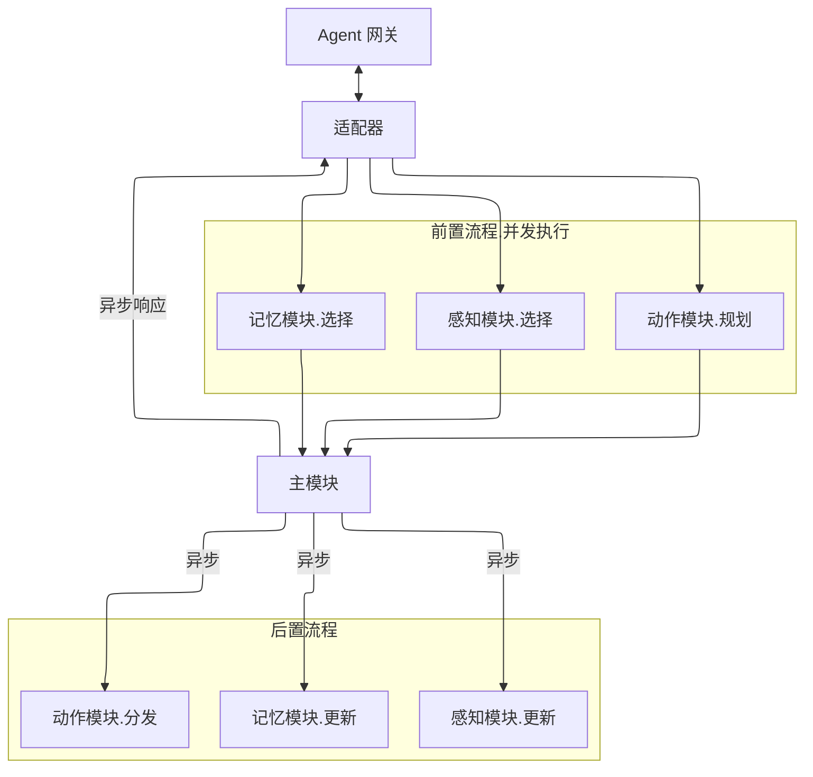

# Partner

Partner 是一个实验性的多模块智能体框架，关注 **长期上下文管理、跨模块协同以及行为驱动的系统演化**。

与强调单次推理或单一能力的智能体实现不同，Partner 将重点放在：

- 结构化记忆的选择、更新与长期组织；
- 感知、行动与记忆模块之间的并发协作；
- 在多轮交互中维持稳定、可演进的系统行为。

该项目仍处于早期实验阶段，核心目标是探索一种 **可扩展、可重组的智能体系统结构**，而非给出最终形态的“通用智能”实现。

## 流程参考

### 整体流程

### 模块流程参考
- [记忆模块](doc/architechture/memory.md)
- [感知模块](doc/architechture/perceive.md)
- [行动模块](doc/architechture/action.md) (尚未完工)
## 核心结构
### 主体部分
#### 结构化记忆系统

构建以**主题树+记忆切片**为基础的记忆图谱.

单个主题节点下存在多级子主题。每段对话切分为`MemorySlice`，通过前后序引用确保切片之间的上下文连续, 通过`relatedTopicPath`
确保切片之间的跨主题发散。切片将聚合为`MemoryNode`(记忆节点)的形式挂载到主题节点。除此之外，每个记忆节点还将按照日期进行索引.

#### 基于时间轮和行动链的行动系统

行动系统由 ActionCore 作为统一能力入口，维护行动池、待确认行动(按用户区分)、可用行动程序(MCP Tool 描述信息)以及语义倾向缓存。行动本体以
ActionData 表达，分为 ImmediateActionData 与 ScheduledActionData 两类，核心结构是按阶段(order)组织的行动链：
`Map<order, List<MetaAction>>`。每个 MetaAction 封装具体行动程序的定位信息、参数容器与执行结果。

整体流程分为规划与分发两段：

- 规划(Pre)：ActionExtractor 先尝试命中语义缓存，否则调用模型抽取行动倾向；ActionEvaluator
  结合可用行动列表与记忆切片评估行动并产出行动链；ActionConfirmer 对需要确认的行动发起确认，确认通过后进入行动池。
- 分发(Post)：ActionDispatcher 将 PREPARE 的行动划分为计划型与即时型。计划型进入 ActionScheduler 持有的时间轮组件，即时型直接进入
  ActionExecutor 并发执行。

执行时，ActionExecutor 以阶段为单位推进行动链，同一阶段内的多个 MetaAction 并行执行，并通过 Phaser 进行阶段同步。参数由
ParamsExtractor 从上下文/历史结果中提取；若参数不足，则 ActionRepairer 通过动态生成行动单元、调用已有行动或发起自对话/用户补充进行修复；阶段结束后
ActionCorrector 可根据执行结果对后续行动链进行修正。

行动干预(ActionInterventor)可在执行中或预备阶段识别用户的“更改行动”意图，经评估后对行动链执行追加、插入、删除、取消或重建等操作。ActionCore
负责将干预应用到具体 ActionData，并确保阶段推进与链变更的互斥安全。

执行环境由 RunnerClient 抽象。LocalRunnerClient 负责本地 MCP 工具调用、动态行动生成与持久化；SandboxRunnerClient
预留为沙盒执行器客户端，实现与远端行动程序的同步与执行。

#### 多用户会话管理

构建区分用户的单上下文窗口、多用户会话的管理机制.

### 框架部分

#### 基于注解驱动的核心服务与上层模块注册机制

1. 基于 Reflections, Proxy, ByteBuddy 的从核心服务到智能体流程的完整基于注解的注册机制
2. 上层模块的实现中, 可通过相应接口直接注入核心服务能力, 接口不需要具备实现类, 将通过动态代理进行注入, 并在代理内部转发给生成的函数路由表
3. 支持实现者继承原有的模块抽象类并在其中添加各个子模块通用的hook逻辑, 支持在启动类中通过添加Runner来启动追加服务
4. 支持可自定义的配置实现类, 但最终返回结构需遵循现有定义, 也可自行提供其完整实现
5. 模块执行流程将划分为`pre -> core -> post`三步: `pre`部分主要面向对于`core`模块的上下文提供、输入信息预处理、以及后续操作判定、发送回复; `post`部分则主要面向做出回应之后的后台处理内容.

> 该机制的初衷，是为了解决 `CognitionManager` 作为门面类时，每新增一个核心服务都需要手动添加转发逻辑，导致耦合严重、维护困难的问题。
>
> 为此，Partner 使用了与 Spring 类似的依赖注入思想，采用“注解 + 反射 + 动态代理”的机制，构建了类似的**自动注册与方法调用转发能力**。
>
> 但与 Spring 不同：
> - Spring 的依赖注入主要发生在**对象实例级别**，关注的是 Bean 的生命周期与依赖管理；
> - 而 Partner 中，核心服务在**方法级别**就已存在复杂的跨服务协同需求，单纯的对象注入难以满足这种粒度（不过在某次重构后这种需求也明显减少了，但这个机制或许可以保留下来）
>
> 因此，系统引入了 `CoordinateManager`，用于维护所有核心服务的**方法路由与协调关系**。系统将在启动时构建协调方法与普通方法的完整路由表，并通过接口代理完成实际调用，无需手动编写注册与转发逻辑。
>
> 模块注册机制原计划作为后续优化任务处理。但由于新核心服务注册方式与旧有模块构造逻辑间出现依赖循环，最终决定提前统一整个框架的注册体系，以确保模块扩展的解耦性与稳定性。

## 模块(已实现/正在实现)

- 预处理模块: `PreprocessExecutor`
- 后处理模块: `PostprocessExecutor`
- 主对话模块: `CoreModel`
- 记忆模块
  - 记忆选择模块: `MemorySelector`
    - 主题提取模块: `MemorySelectExtractor`
    - 切片评估模块: `SliceSelectEvaluator`
  - 记忆更新模块: `MemoryUpdater`
    - 记忆总结模块[多聊天对象]: `MultiSummarizer`
    - 记忆总结模块[单聊天对象]: `SingleSummarizer`
    - 记忆总结模块[汇总]: `TotalSummarizer`
- 感知模块
  - 感知选择模块: `PerceiveSelector`
  - 感知更新模块: `PerceiveUpdater`
    - 关系提取模块: `RelationExtractor`
    - 静态记忆提取模块: `StaticMemoryExtractor`
- 行动模块
  - 行动规划模块: `ActionPlanner`
    - 行动确认模块: `ActionConfirmer`
    - 行动提取模块: `ActionExtractor`
    - 行动评估模块: `ActionEvaluator`
  - 行动分发模块: `ActionDispatcher`
    - 行动调度模块: `ActionScheduler`
    - 行动执行模块: `ActionExecutor`
  - 行动干预模块: `ActionInterventor`
    - 干预识别模块: `InterventionRecognizer`
    - 干预评估模块: `InterventionEvaluator`

## 当前问题

- 系统的正常运作效果取决于各模块中大模型对于`prompt`的遵循能力，目前来看`qwen3`的遵循效果明显较好，但在轮次较多时，也容易出现不遵循的情况。

## 规划

- [ ] 继续完善当前行动模块
- [ ] 调整记忆模块实现机制
- [ ] 将当前行动模块中的语义缓存机制同样应用于记忆模块，可用作主题提取流程的快速匹配
- [ ] 回顾时发现不少遗留的逻辑错误或不合适的处理规则，需要找时间回顾整个流程并做出修正
- [ ] 服务端与客户端的通信加上消息队列，防止消息因连接断开而丢失。
- [ ] 实现流式输出，同时在各模块执行时可向客户端返回回调信息，优化使用体验。(现在用的是`websocket`与客户端通信, 应该实现这点会简单些)
- [ ] 踩坑。
- [ ] 实现演进机制

## License

This project is not licensed for public use. All rights reserved.

Partner is currently in an early experimental phase. Code, logic, and architecture are rapidly evolving.  
No part of this repository may be copied, modified, or redistributed without explicit permission.

For collaboration or inquiries, contact the maintainer directly.
