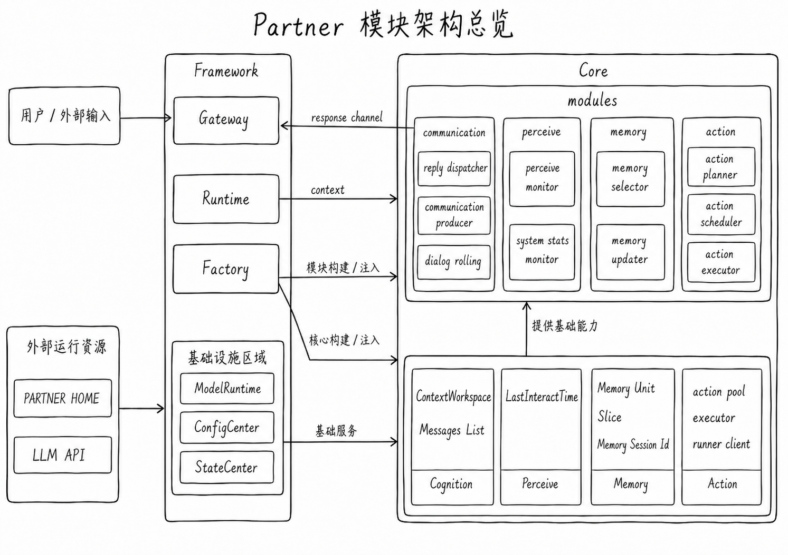

# Partner

## 项目介绍

> 当前项目仍处在实验和快速迭代阶段，部分模块已经形成稳定边界，部分模块仍在调整

基于 Java/Kotlin 的模块化 AI Agent Runtime，围绕动态上下文工作空间、可干预的行动链执行、存储与组织解耦的记忆实现，构建支持多模块异步协作的可扩展
Agent 运行内核。



> 详细文档查看: [相关文档](#相关文档)
---

## 项目启动

**环境要求**

- JDK 21
- Maven 3.x

### 手动准备环境并启动

#### 克隆项目并构建

```bash
git clone https://github.com/slhaf/Partner
cd Partner
mvn clean package -DskipTests
```

> 当前项目仍处在快速迭代阶段，部分测试依赖尚未稳定的运行时行为。若目标只是从源码构建可运行 jar，推荐先使用 `-DskipTests`
> 跳过测试。

构建完成后，主程序 jar 位于：

```
Partner-Core/target/Partner-Core-0.5.0.jar
```

#### 准备必需配置

Partner 默认从 `~/.partner` 读取运行时配置，也可以通过 `PARTNER_HOME` 指定其他目录：

```bash
export PARTNER_HOME="$HOME/.partner"
mkdir -p "$PARTNER_HOME/config"
```

创建 WebSocket Gateway 配置：

```bash
cat > "$PARTNER_HOME/config/gateway.json" <<'EOF'
{
  "default_channel": "websocket_channel",
  "channels": [
    {
      "channel_name": "websocket_channel",
      "params": {
        "hostname": "127.0.0.1",
        "port": "29600",
        "heartbeat_interval": "10000"
      }
    }
  ]
}
EOF
```

配置默认模型：

```bash
export PARTNER_DEFAULT_BASE_URL="https://your-openai-compatible-endpoint/v1/chat/completions"
export PARTNER_DEFAULT_API_KEY="your-api-key"
export PARTNER_DEFAULT_MODEL="your-model-name"
```

也可以使用 `$PARTNER_HOME/config/model.json` 声明模型 provider：

```json
{
  "providerConfigSet": [
    {
      "name": "default",
      "type": "OPENAI_COMPATIBLE",
      "defaultModel": "your-model-name",
      "baseUrl": "https://your-openai-compatible-endpoint/v1/chat/completions",
      "apiKey": "your-api-key"
    }
  ],
  "runtimeConfigSet": []
}
```

> 其余详细配置信息参考 [相关文档#配置说明](doc/config/configuration.md)

#### 启动

```
java -jar Partner-Core/target/Partner-Core-0.5.0.jar
```

---

## 项目结构

```text
Partner/
├── Partner-Framework/        # Agent 运行框架与通用基础设施
│   └── src/main/java/work/slhaf/partner/framework/agent/
│       ├── config/           # 配置中心与配置路径解析
│       ├── factory/          # 组件注册、Capability 注入与初始化流程
│       ├── interaction/      # Gateway、运行时调度、输入输出通道
│       ├── model/            # 模型 Provider、模型运行时与消息结构
│       ├── state/            # 状态持久化支持
│       └── support/          # Result、目录监听等基础支持
├── Partner-Core/             # Partner 主运行时与核心模块
│   └── src/main/java/work/slhaf/partner/
│       ├── core/             # 感知、认知、记忆、行动等核心能力接口与状态
│       ├── module/           # 实际参与运行流的模块实现
│       ├── runtime/          # 主运行上下文、Gateway 实现与运行时异常处理
│       ├── common/           # Core 内部共享的基础能力
│       └── Main.java         # 启动入口
├── doc/                      # 设计说明与补充文档
├── pom.xml                   # Maven 父工程
└── README.md
```

- `Partner-Framework`：提供 Agent 运行所需的基础框架能力，包括配置加载、组件注册、Capability 注入、模型调用、Gateway
  注册、运行时调度和状态管理。
- `Partner-Core`：承载 Partner 的主运行逻辑和核心模块实现，包括感知、认知、记忆、行动、通信等能力域。
- `doc/`：用于沉淀更细的设计文档，README 只保留项目入口和最小启动路径。

---

## 相关文档

### 已完成

- [整体架构与运行流](doc/architecture/overview.md)

### 待完成

- [ContextWorkspace](doc/context/context-workspace.md)
- [行动系统](doc/action/action.md)
- [记忆存储与组织](doc/memory/memory.md)
- [模型提供商](doc/model/providers.md)
- [配置说明](doc/config/configuration.md)

---

## License

暂未指定。

