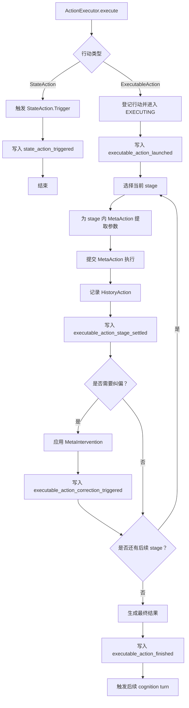

# 行动执行

本文介绍 Partner 中行动系统的执行流程。

Partner 中的行动分为两类：`StateAction` 和 `ExecutableAction`
。前者用于短路径的状态更新或逻辑触发；后者承载完整行动链，会经过阶段推进、参数提取、行动执行、结果记录和必要的纠偏过程。行动建模见 [MetaAction 与行动链建模](meta-action-and-action-chain.md)。

## 主流程



主流程中，`StateAction` 和 `ExecutableAction` 使用同一个执行入口，但运行路径不同。

- `StateAction` 直接触发内部逻辑，适合计时、轮询、状态更新等短任务。
- `ExecutableAction` 按行动链推进，适合需要调用一个或多个 `MetaAction` 的任务。

## ExecutableAction 的阶段推进

`ExecutableAction` 的行动链按 stage 组织：

```text
actionChain: Map<Int, List<MetaAction>>
```

执行器每次选择当前 stage，并执行该 stage 下的 `MetaAction` 列表。同一个 stage 内的多个 `MetaAction` 可以并发执行；stage
之间按顺序推进。

每个 stage 完成后，执行器会把该阶段的执行结果写入 history，并向 `ContextWorkspace` 发布阶段结算状态。后续
stage、纠偏模块和沟通模块都可以基于这些结果继续工作。

## 参数提取

`MetaAction` 在行动链中只表示“要调用哪个行动能力”，并不提前固定所有参数。

执行器在真正执行某个 `MetaAction` 前，会根据当前行动描述、当前 stage 描述和已有执行上下文进行参数提取。提取出的参数写入
`metaAction.params` 后，再交给 runner 执行。

这种设计把“行动规划”和“运行时参数确定”分开：规划阶段确定能力链，执行阶段结合当前上下文确定具体参数。

## 执行结果与历史

每个 `MetaAction` 执行后都会产生单步结果，并被记录为 `HistoryAction`。

`HistoryAction` 记录三类信息：

- action key
- action description
- action result

这些历史用于支撑后续参数提取、纠偏判断、最终结果生成和上下文反馈。

`ExecutableAction` 的最终结果通常来自行动链最后阶段的执行结果。如果没有明确结果，执行器会根据成功或失败状态生成兜底结果。

## 纠偏

执行器不会假设初始行动链一定能一次完成目标。阶段执行后，如果出现失败、偏离目标或最终检查不满足预期，执行器可以触发纠偏流程。

纠偏流程会生成 `MetaIntervention`，用于调整后续行动链。它可能插入新的行动、替换已有行动，或让行动进入失败状态。

纠偏事件会写入 `ContextWorkspace`，让后续模块知道行动链为什么发生变化，以及哪些 stage 受到了影响。

## 超时、失败与恢复

每个 action 都有 timeout。执行超时后，执行器会取消任务，将 action 标记为 `FAILED`，并写入失败结果。

失败可能来自：

- 行动链为空。
- 参数提取失败。
- `MetaAction` 执行失败。
- 纠偏后仍无法继续推进。
- 未捕获异常或超时。

执行器初始化时会恢复未完成行动：状态为 `EXECUTING` 的行动会重新提交；状态为 `INTERRUPTED` 的行动会恢复为 `EXECUTING`
后继续执行。恢复事件会写入 `actions_recovered` 上下文块。

## ContextWorkspace 反馈

行动执行层会把关键运行事件写入 `ContextWorkspace` 的 `ACTION` 域。

| 事件                                       | 含义                      |
|------------------------------------------|-------------------------|
| `actions_recovered`                      | 执行器恢复了未完成行动             |
| `state_action_triggered`                 | `StateAction` 被触发       |
| `executable_action_launched`             | `ExecutableAction` 开始执行 |
| `executable_action_stage_settled`        | 某个 stage 已结算            |
| `executable_action_correction_triggered` | 执行过程中触发纠偏               |
| `executable_action_finished`             | 行动执行完成                  |

这些上下文块让行动状态可以被后续行动评估、认知模块和沟通模块读取。行动完成后，执行器还会触发新的 cognition
turn，用于在合适时机向用户反馈结果。

## 相关组件

### ParamsExtractor

`ParamsExtractor` 负责在执行前为 `MetaAction` 生成参数。它根据行动描述、当前 stage 目标和运行时上下文，把抽象的行动能力转换成可提交执行的具体调用参数。

### RunnerClient

`RunnerClient` 是 `MetaAction` 的提交入口。执行器完成参数提取后，把 `MetaAction` 交给 `RunnerClient`，由后者根据行动类型路由到对应执行通道。

### ActionCorrectionRecognizer

`ActionCorrectionRecognizer` 负责判断行动过程或最终结果是否需要纠偏。它不是执行器本身，而是执行器在阶段结算或最终检查时使用的判断模块。

### ActionCorrector

`ActionCorrector` 负责生成纠偏方案。它输出的 `MetaIntervention` 会作用到行动链上，用于补充、替换或调整后续执行步骤。
