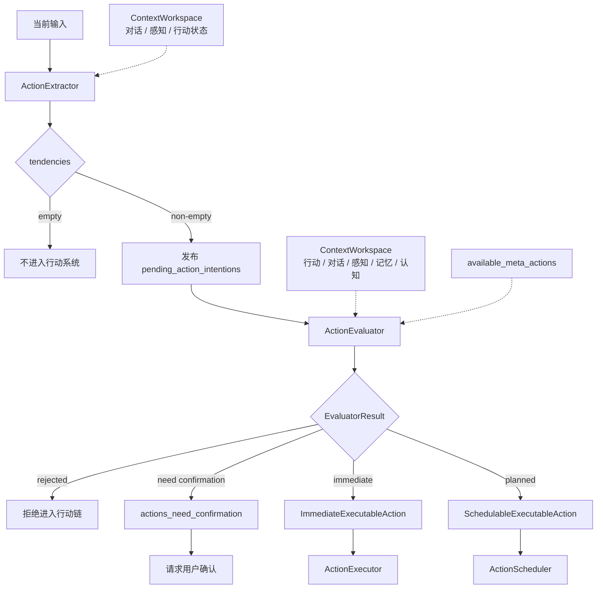

# 行动提取与评估

本文介绍 Partner 行动系统的入口决策层：如何从输入中识别行动意图，并在进入执行或调度前完成可行性评估。

行动提取与评估位于 `ActionPlanner` 的前半段。它的输出不是执行结果，而是一个明确的运行时决策：本轮输入是否应进入行动系统；如果进入，应当成为即时行动、计划行动，还是等待用户确认。

## 入口决策层

行动系统面对的输入通常并不直接等同于行动。用户可能是在提问、讨论、确认、补充条件，也可能是在要求系统实际完成某件事。入口决策层负责把这些情况分开。

它需要在三个对象之间建立关系：

- **输入意图**：来自用户或认知模块的当前表达。
- **上下文状态**：当前会话、感知、记忆、认知和已有行动状态。
- **行动能力**：系统当前真实可用的 `MetaAction` 集合。

只有当一个意图能在当前上下文中被解释为可推进目标，并且存在可承接的行动能力时，它才会进入行动建模与执行链路。

## 分层职责

行动入口被拆成三个层次：

```text
ActionExtractor
  负责发现候选行动倾向

ActionEvaluator
  负责判断候选倾向是否可推进

ActionPlanner
  负责把评估结果装配为运行时行动
```

三者的边界如下：

| 层次                | 输入                       | 输出                                                           | 不负责            |
|-------------------|--------------------------|--------------------------------------------------------------|----------------|
| `ActionExtractor` | 当前输入 + 上下文               | `tendencies`                                                 | 生成行动链、判断能力是否足够 |
| `ActionEvaluator` | 单条 tendency + 上下文 + 可用能力 | `EvaluatorResult`                                            | 执行行动、持久化行动对象   |
| `ActionPlanner`   | `EvaluatorResult`        | `ExecutableAction` / pending confirmation / refused tendency | 重新解释用户意图       |

这种分层使“发现可能要做的事”和“决定能不能做”相互独立。提取阶段保持轻量，评估阶段负责执行前的结构化判断，Planner 负责与行动运行时交接。

## 主流程



## ActionExtractor：候选行动发现

`ActionExtractor` 的职责是从当前输入中提取行动倾向。倾向不是行动计划，而是一个待评估目标。

行动倾向应保持“目标语义”，而不是“执行语义”。例如用户说“先检查配置，再修复问题，最后告诉我结果”，提取结果应表达为一个整体目标，而不是拆成多个工具步骤。

提取阶段只决定是否存在候选目标，不承诺该目标一定能执行。它不会绑定 `MetaAction`，也不会判断是否需要确认。

### 提取边界

行动倾向通常对应以下语义：

- 用户要求系统代为完成某件事。
- 当前目标需要访问能力、操作对象、修改状态或安排未来动作。
- 该目标如果不进入行动链，就无法被实际推进。

普通交流不应进入行动系统。解释、分析、翻译、总结、评价、闲聊，以及可直接基于当前上下文回答的问题，都应留给沟通模块处理。

这条边界能避免行动系统过度激活。

## ActionEvaluator：执行前判断

`ActionEvaluator` 对单条 tendency 做执行前判断。它不重新提取意图，而是在当前上下文和能力集合下判断该倾向是否可推进。

评估阶段主要形成四类结论：

| 结论   | 含义                                   |
|------|--------------------------------------|
| 拒绝   | 倾向不应进入行动链，原因可能是无需行动、能力不足、目标不清或已有行动覆盖 |
| 待确认  | 行动可以建模，但执行前需要用户确认                    |
| 即时行动 | 行动可以立即装配并交给执行器                       |
| 计划行动 | 行动应按未来时间、周期或条件进入调度器                  |

评估结果通过 `EvaluatorResult` 表达。它是 planner 的输入契约，而不是给用户展示的回复文案。

## 确认与 pending action

某些行动虽然可以建模，但不能直接执行。典型原因包括副作用、权限风险、外部可见影响、长期运行影响或用户意图仍需最终确认。

这类行动会进入 pending confirmation：

```text
EvaluatorResult(ok=true, needConfirm=true)
  ↓
ActionPlanner
  ↓
ContextWorkspace.register(actions_need_confirmation)
  ↓
后续输入承接确认 / 取消 / 修改
```

> pending confirmation 将借助 CommunicationBlockContent 作为输入时的补充块，用来及时提醒交流模块生产合适响应。

## Planner 装配

`ActionPlanner` 异步接收评估结果后，把结构化决策转换为运行时对象。

主要装配动作包括：

- 将 `primaryActionChain` 转换为 `Map<Int, List<MetaAction>>`。
- 加载每个 action key 对应的 `MetaAction`。
- 根据 `MetaActionInfo` 修正顺序并补齐严格依赖。
- 根据评估类型构造 `ImmediateExecutableAction` 或 `SchedulableExecutableAction`。
- 对待确认行动注册 `actions_need_confirmation`。
- 对已承接的 pending block 执行过期。
- 将即时行动交给 `ActionExecutor`，将计划行动交给 `ActionScheduler`。

Planner 是入口决策层与运行时执行层之间的边界。评估器给出“应该怎样推进”，Planner 负责把这个结论变成可运行对象。

## 输出流向

评估和装配后的输出分为四种：

| 流向      | 说明                                      |
|---------|-----------------------------------------|
| 不进入行动系统 | 没有提取到 tendency，或评估认为无需行动                |
| 等待确认    | 行动可建模，但先写入 pending confirmation         |
| 即时执行    | 构造 `ImmediateExecutableAction` 并交给执行器   |
| 计划调度    | 构造 `SchedulableExecutableAction` 并交给调度器 |

这四种流向共同构成行动系统的入口安全阀。任何行动在进入执行器前，都必须先经过提取、评估和 planner 装配。
