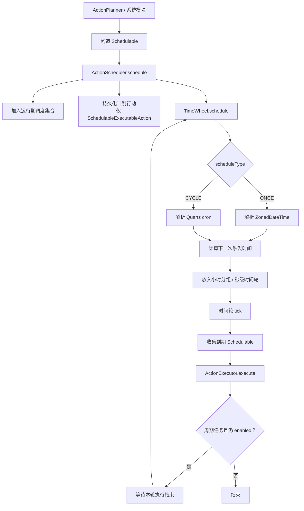

# 行动计划与调度

本文介绍 Partner 行动系统中的计划行动与调度机制。

计划调度负责处理“不是立即执行”的行动，包括未来某一时间执行、周期性执行，以及用于状态更新或轮询的内部触发任务。它把行动从当前对话轮次中解耦出来，使行动可以在后续时间点重新进入执行流程。

## 调度对象

行动系统中可以被调度的对象都实现 `Schedulable`。

`Schedulable` 主要描述三个信息：

- `scheduleType`：调度类型，当前包括 `ONCE` 和 `CYCLE`。
- `scheduleContent`：调度内容，按调度类型保存执行时间或 cron 表达式。
- `enabled`：调度对象是否仍然有效。

当前主要有两类调度对象：

| 类型                            | 作用                                  |
|-------------------------------|-------------------------------------|
| `SchedulableExecutableAction` | 带行动链的计划行动，到期后交给 `ActionExecutor` 执行 |
| `StateAction`                 | 不带行动链的状态触发任务，到期后直接触发内部逻辑            |

`SchedulableExecutableAction` 用于用户可感知的未来行动；`StateAction` 更多用于系统内部，例如状态更新、轮询 watcher、一次性逻辑触发。

## 主流程



调度器只决定“什么时候触发”，不决定“如何执行”。到期后的对象统一交给 `ActionExecutor`。

## 调度类型

### ONCE

`ONCE` 表示一次性调度。

`scheduleContent` 保存一个可解析为 `ZonedDateTime` 的时间字符串。调度器会在该时间点触发 action；触发后不会再次调度。

一次性调度适合：

- 指定时间执行某个行动。
- 延迟执行一次任务。
- 创建只触发一次的内部 watcher。

### CYCLE

`CYCLE` 表示周期性调度。

`scheduleContent` 保存 Quartz cron 表达式。每次触发后，如果调度对象仍然有效，并且本轮执行已经结束，调度器会计算下一次执行时间并重新放入时间轮。

周期性调度适合：

- 周期检查。
- 周期同步。
- 长期状态更新。
- 按固定频率轮询某个 action 状态。

## 相关组件

### ActionScheduler

`ActionScheduler` 是调度入口。

它负责：

- 接收新的 `Schedulable`。
- 保存运行期调度对象。
- 持久化用户可感知的计划行动。
- 把调度对象交给 `TimeWheel`。
- 在触发时调用 `ActionExecutor.execute(action)`。
- 取消指定 action id 对应的调度对象。

调度器本身不执行行动链，也不处理 `MetaAction` 参数。到期后的执行仍然统一交给 `ActionExecutor`。

### TimeWheel

`TimeWheel` 是调度器内部的时间轮实现。

它维护两层结构：

- 按小时分组的调度对象集合。
- 当前小时内按秒排列的触发 bucket。

这种结构避免对所有计划任务进行高频全量扫描。调度器按天和小时刷新任务，再在当前小时内用秒级 tick 收集到期任务。

当某个 tick 到达时，时间轮会收集对应 bucket 中仍然 `enabled` 的对象，并调用触发回调。当前触发回调会把这些对象交给
`ActionExecutor`。

## 周期任务重入

周期任务触发后不会立即无条件重新入轮。

对于 `CYCLE` 类型，时间轮会等待本轮 action 满足完成条件后再重新计算下一次执行时间。当前完成条件主要依据 action 状态：

- `SUCCESS`
- `FAILED`

如果调度对象在等待期间被取消，或 `enabled=false`，则不会再次调度。

这可以避免周期任务在上一轮尚未结束时重复触发，导致同一个行动并发堆积。

## 持久化与运行期调度

调度对象有两类来源：

- **持久化行动**：主要是 `SchedulableExecutableAction`，通过 `ActionCapability` 保存和恢复。
- **运行期调度**：例如 watcher 或内部 `StateAction`，只保存在当前运行期。

调度器初始化时会同时读取持久化计划行动和仍然有效的运行期调度对象，并装载到时间轮中。

这使用户可感知的计划行动能够跨运行周期保留，而内部临时调度可以只存在于当前运行期。

## 取消调度

`ActionScheduler.cancel(actionId)` 会从两个来源查找调度对象：

- 当前运行期调度集合。
- 已持久化的 `SchedulableExecutableAction`。

找到后会将其 `enabled` 置为 `false`，并尝试从时间轮的 bucket 中移除。

取消并不依赖对象当前位于哪一层时间结构：无论对象还在小时分组中，还是已经进入当前小时的秒级时间轮，都会尝试移除。

## 与行动执行的关系

调度器只负责触发时机，执行过程仍由 `ActionExecutor` 负责。

```text
ActionScheduler
  ↓
ActionExecutor.execute(action)
```

因此：

- `SchedulableExecutableAction` 到期后按完整行动链执行。
- `StateAction` 到期后触发内部逻辑。
- 执行结果、失败、纠偏和上下文反馈仍然由执行器负责。

## 与计划行动的关系

计划行动通常来自行动评估结果中的规划流向：

```text
ActionEvaluator
  ↓
EvaluatorResult(type = PLANNING, scheduleData)
  ↓
ActionPlanner
  ↓
SchedulableExecutableAction
  ↓
ActionScheduler.schedule
```

`SchedulableExecutableAction` 保留普通 `ExecutableAction` 的行动链、原因、描述和来源，同时增加调度类型和调度内容。到期执行时，它与即时行动使用同一个执行器。

周期性计划行动执行结束后，会记录本轮执行历史并重置内部状态，以便下一次触发重新执行同一行动链。

## 时间表达

当前调度内容由 `scheduleType` 决定解析方式：

| `scheduleType` | `scheduleContent`   |
|----------------|---------------------|
| `ONCE`         | `ZonedDateTime` 字符串 |
| `CYCLE`        | Quartz cron 表达式     |

如果调度内容无法解析，调度器会跳过加载该调度对象并记录失败状态。

一次性任务如果已经过期，或不属于当前日期，也不会进入时间轮。