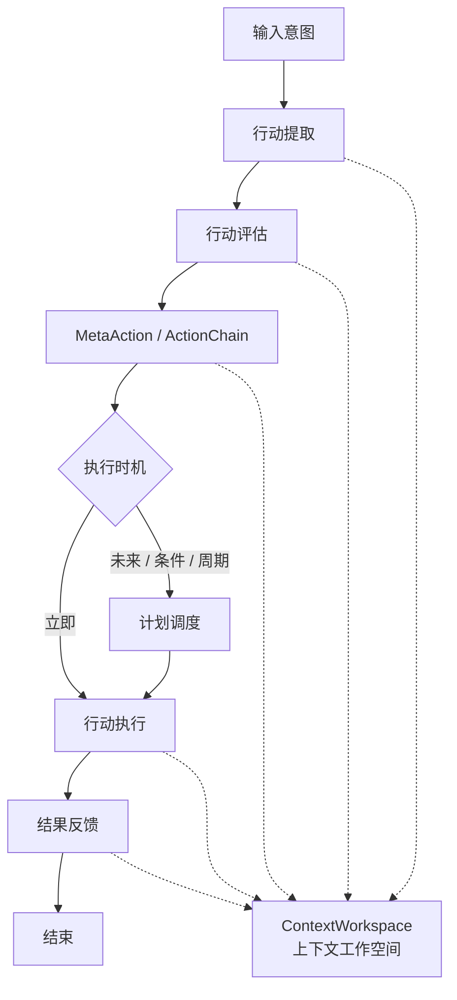

# 行动系统

本文说明 Partner 中行动系统的流程总览。行动系统负责把来自用户、认知模块或计划模块的“意图”转化为可建模、可评估、可执行、可调度、可追踪的行动对象。

在 Partner 中，行动不是一次简单的 tool call。一次行动可能包含多个阶段，每个阶段又可以包含多个可执行的 `MetaAction`；它可能被立即执行，也可能被登记为未来的一次性或周期性计划；它的执行过程还需要与 `ContextWorkspace` 交互，让行动提取、评估、执行和结果反馈都能进入统一的上下文循环。

## 目录

行动系统的细节设计拆分到以下专题文档中说明：

- [`meta-action-and-action-chain.md`](meta-action-and-action-chain.md)：说明 `MetaAction`、`ExecutableAction` 与行动链的建模方式。
- [`action-extraction-and-evaluation.md`](action-extraction-and-evaluation.md)：说明如何从输入意图中提取候选行动，并判断行动是否完整、可执行、需要确认或需要调度。
- [`action-execution.md`](action-execution.md)：说明行动执行器如何按阶段执行行动链，并处理结果、失败、中断与恢复。
- [`action-planning-and-action-scheduling.md`](action-planning-and-action-scheduling.md)：说明未来行动、周期行动与状态触发行动如何被计划和调度。
- [`action-infrastructure.md`](action-infrastructure.md)：说明 `RunnerClient`、执行策略、命令执行和 Origin action 等底层行动基础设施。

本文只提供总览，不展开每个模块的内部实现细节。

## 核心对象

行动系统围绕三类对象组织：

- `MetaAction`：行动链中的单步可执行元素，用于描述具体要调用的行动程序。它包含行动名称、类型、位置、参数和执行结果。当前行动类型包括 `MCP`、`ORIGIN` 与 `BUILTIN`。
- `ExecutableAction`：可执行行动的抽象基类，承载行动来源、原因、描述、倾向、状态、阶段化行动链、阶段描述、执行历史与最终结果。
- `Schedulable`：可调度对象的统一接口，用于表达一次性或周期性触发。`SchedulableExecutableAction` 表示未来执行的行动链，`StateAction` 表示到期或周期性触发的状态更新 / 逻辑调用。

从粒度上看：

```text
Action
  ├─ ExecutableAction
  │   ├─ ImmediateExecutableAction
  │   └─ SchedulableExecutableAction
  └─ StateAction

ExecutableAction
  └─ actionChain: Map<Stage, List<MetaAction>>
```

也就是说，`MetaAction` 是最小执行单元，`ExecutableAction` 是面向一次任务的行动容器，`Schedulable` 则给行动增加时间维度。

## 系统流程



虚线表示 `ContextWorkspace` 对行动系统的横切参与：行动提取与评估会读取当前上下文，行动建模、执行与反馈则可能发布新的上下文块，供后续认知、记忆和沟通模块继续使用。

## 主链路说明

一次行动通常经历以下阶段：

1. **输入意图**

   输入意图可以来自用户显式指令，也可以来自认知模块推导出的内部目标，或来自已经登记的计划行动。行动系统首先要判断这段意图是否包含“需要系统实际去做”的部分。

2. **行动提取**

   行动提取负责把自然语言意图或内部决策结果转化为候选行动。此阶段关注“是否存在可执行目标”，而不是立即执行。提取结果可能只是一个候选行动，也可能是一组带有阶段关系的行动链。

3. **行动评估**

   行动评估负责判断候选行动是否可以进入后续流程。评估内容包括参数是否完整、能力是否存在、风险是否可接受、是否需要用户确认、是否应该立即执行，以及是否应该转化为未来计划。

4. **行动建模**

   通过评估的行动会被建模为 `ExecutableAction`。如果一个任务需要多个步骤，它会被拆成按阶段组织的 `actionChain`：外层 stage 表示阶段顺序，内层 `MetaAction` 列表表示同一阶段下的一组行动单元。

5. **执行时机判断**

   行动建模后会进入执行时机分流：

   - 即时行动会成为 `ImmediateExecutableAction`，交给执行器运行。
   - 未来行动会成为 `SchedulableExecutableAction`，由调度器在指定时间、周期或条件满足后触发。
   - 状态类触发任务会成为 `StateAction`，用于周期性状态更新或普通逻辑调用。

6. **行动执行**

   行动执行器按阶段执行行动链。每个 `MetaAction` 会根据类型映射到不同执行通道：`MCP` 调用 MCP tool，`BUILTIN` 调用内置行动注册表，`ORIGIN` 对应临时生成或持久化的行动程序。执行过程中会更新行动状态、阶段、单步结果与历史记录。

7. **结果反馈**

   执行结束后，行动结果会回写到行动对象，并通过上下文、trace 或用户可见响应进入反馈闭环。成功结果可以成为后续认知和记忆的输入；失败、中断或修正信息也会被保留，以便后续恢复、纠错或重新规划。

## 状态与生命周期

`Action` 使用统一状态描述生命周期：

- `PREPARE`：行动已创建，等待执行或调度。
- `EXECUTING`：行动正在执行。
- `INTERRUPTED`：行动被暂时中断，等待恢复或超时退出。
- `SUCCESS`：行动执行成功。
- `FAILED`：行动执行失败。

`MetaAction` 自身也维护单步结果状态：

- `WAITING`：单步行动尚未执行或已经重置。
- `SUCCESS`：单步行动执行成功。
- `FAILED`：单步行动执行失败。

这种双层状态设计区分了“整个行动任务的生命周期”和“行动链中单个执行单元的结果”。

## 与 ContextWorkspace 的关系

行动系统与 `ContextWorkspace` 不是上下级关系，而是运行时协作关系。

- 行动提取需要读取上下文，以判断用户当前意图与历史状态之间的关系。
- 行动评估需要读取上下文，以判断参数、权限、风险和依赖是否满足。
- 行动建模可以把待执行行动、阶段目标或计划信息发布为上下文块。
- 行动执行可以把执行中的状态、当前阶段、失败原因或等待条件暴露给上下文系统。
- 结果反馈可以把最终结果、历史记录或修正信息写回上下文，供后续认知模块继续使用。

因此，`ContextWorkspace` 是行动系统的上下文协调层：它不直接决定行动如何执行，但影响行动如何被理解、评估、观察和回收反馈。

## 设计取向

行动系统的目标是让 Partner 的“行动能力”具备以下特征：

- **可建模**：行动不是临时字符串，而是带有来源、原因、描述、阶段、状态和结果的结构化对象。
- **可组合**：复杂任务可以拆成阶段化行动链，每个阶段包含一个或多个 `MetaAction`。
- **可评估**：行动在执行前经过提取与评估，避免把所有意图都直接转成工具调用。
- **可调度**：未来行动、周期行动和状态触发行动可以脱离当前对话轮次继续存在。
- **可观察**：行动状态、执行历史、结果和上下文反馈可以被追踪，便于调试与后续推理。

总览页只描述行动系统的主干。后续专题文档会分别展开行动建模、提取评估、执行机制、计划调度和基础设施。