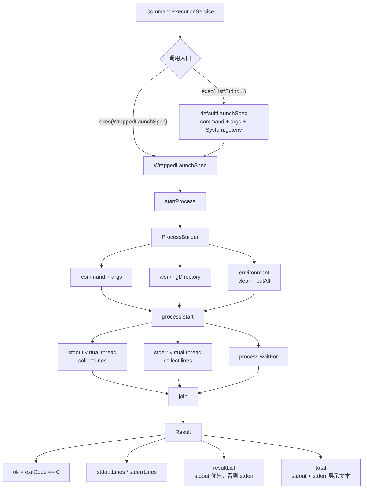
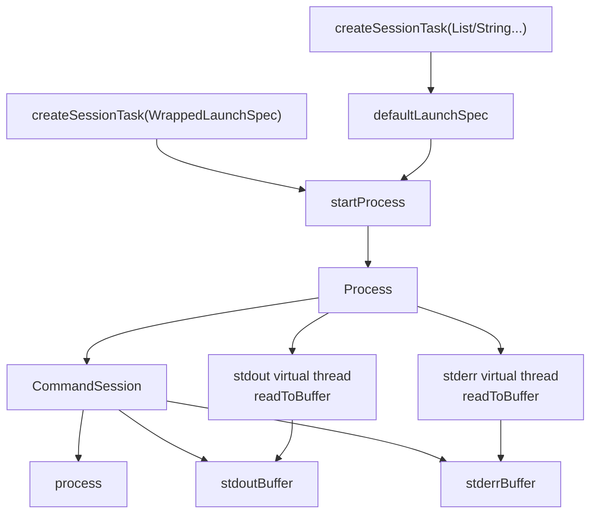

# CommandExecutionService

`CommandExecutionService` 是命令执行的最低层服务。它接收 `WrappedLaunchSpec` 或原始命令数组，负责启动进程、传入环境变量与工作目录、收集输出，并把进程执行结果转换为结构化 `Result`。

它有两类执行路径：

- 一次性命令：调用 `exec(...)`，等待进程结束后返回完整结果。
- 持久命令：调用 `createSessionTask(...)`，返回 `CommandSession`，由调用方持有进程与输出缓冲区。



一次性命令会同步等待进程结束，并用两个虚拟线程分别读取 stdout 和 stderr。进程退出后，执行服务等待输出读取线程结束，再构造 `Result`。

`Result` 中几个字段的语义如下：

| 字段 | 语义 |
|---|---|
| `ok` | 进程退出码是否为 0，或异常路径下为 false |
| `stdoutLines` | 标准输出逐行结果 |
| `stderrLines` | 标准错误逐行结果 |
| `resultList` | 优先使用 stdout；如果 stdout 为空，则使用 stderr |
| `total` | 合并后的展示文本，stdout 和 stderr 都存在时按顺序拼接 |

异常会被转换为失败结果：`ok=false`，`stderrLines` 与 `resultList` 保存异常信息，`total` 保存异常 message。

持久命令路径用于需要保留进程句柄和持续读取输出的场景：



`CommandSession` 不等待进程结束，也不生成 `Result`。它保留 `Process`、`stdoutBuffer` 和 `stderrBuffer`，让上层可以在长生命周期命令运行期间自行读取输出、判断状态或终止进程。

`buildFileExecutionCommands` 是 `ORIGIN` 路由使用的命令构造辅助方法。它把 action 文件执行转换为：

```text
launcher absolutePath --param=value ...
```

随后这组 commands 会先进入 `ExecutionPolicyRegistry.prepare`，再由 `CommandExecutionService.exec(WrappedLaunchSpec)` 真正启动进程。
