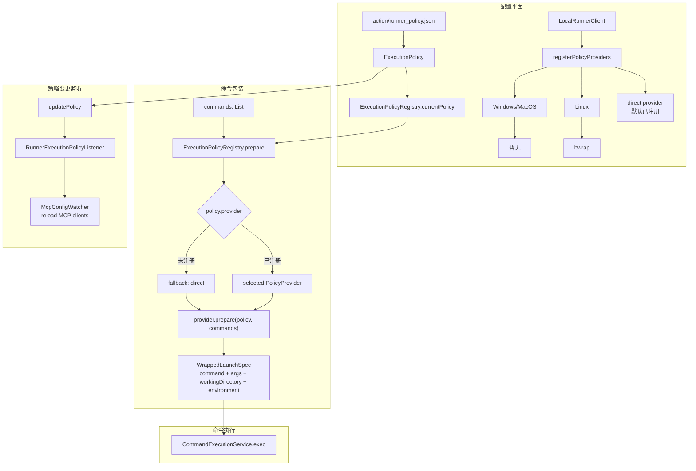

# 执行策略

执行策略用于把原始命令包装成具体可启动的 `WrappedLaunchSpec`。它位于 `OriginExecutionService`、动态 action MCP 执行和底层 `CommandExecutionService` 之间，负责在命令真正交给进程执行前应用运行策略。

`ExecutionPolicyRegistry` 本身不执行命令，只选择 provider 并返回包装后的启动规格。当前默认 provider 是 `direct`；在 Linux 环境下，`LocalRunnerClient` 会额外注册 `bwrap` provider。

`ExecutionPolicy` 描述运行策略，包括 provider、运行模式、网络开关、是否继承环境变量、额外环境变量、工作目录，以及只读 / 可写路径集合。provider 会根据这些信息生成最终的 `WrappedLaunchSpec`：

| provider | 生效方式 |
|---|---|
| `direct` | 直接使用原始命令和参数，附加工作目录与环境变量 |
| `bwrap` | 使用 `bwrap` 包装原始命令，按策略加入网络隔离、路径绑定和工作目录设置 |

`ExecutionPolicyRegistry` 也维护策略变更 listener。`McpConfigWatcher` 会注册为 listener；当 policy 被更新时，它可以重新加载 MCP client，使 MCP server 的启动规格与最新执行策略保持一致。

> 当前沙箱仅支持 Linux，其他平台暂未提供沙箱支持，后续会进行补充。
