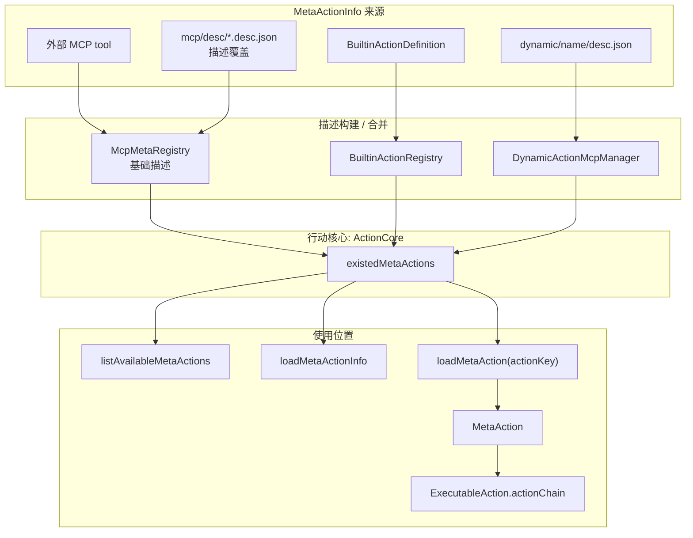

# MetaActionInfo 行动描述覆写

`MetaActionInfo` 是行动能力进入 planner / evaluator / executor 前的描述层。它不负责执行行动，而是描述一个 action 可以被如何理解、选择、组装和调用。

不同来源的行动能力都会汇入 `ActionCore.existedMetaActions`，但它们生成描述信息的方式不同：

- 外部 MCP tool 会先生成基础 `MetaActionInfo`，再允许通过 `mcp/desc/*.desc.json` 进行覆盖。
- BUILTIN action 在注册时直接提供 `MetaActionInfo`。
- dynamic action 使用 `dynamic/<name>/desc.json` 作为描述来源。

描述覆写主要服务于外部 MCP tool。外部 tool 自带的信息通常只够完成调用，但不一定足够支撑 Partner 的行动规划。`mcp/desc/*.desc.json` 可以补充或覆盖这些信息，让外部 tool 进入行动系统后具备更完整的行动语义。

当前描述信息会影响：

| 信息 | 作用 |
|---|---|
| `description` | 让评估器和规划器理解 action 的用途 |
| `params` | 描述行动参数，用于参数提取和调用装配 |
| `launcher` | 为 ORIGIN / dynamic action 提供启动器信息 |
| `io` | 描述输入输出形态，辅助行动组合 |
| `preActions` / `postActions` | 描述行动前后依赖关系 |
| `strictDependencies` | 表达必须满足的行动依赖 |
| `tags` | 为 action 分类和筛选提供辅助信息 |

`ActionCore.loadMetaAction(actionKey)` 会根据 action key 前缀构造 `MetaAction`，但 `MetaActionInfo` 本身不会直接执行。它的价值在于让系统在执行前能够知道：有哪些 action 可用、它们需要什么参数、适合什么场景，以及是否存在依赖或补充约束。
