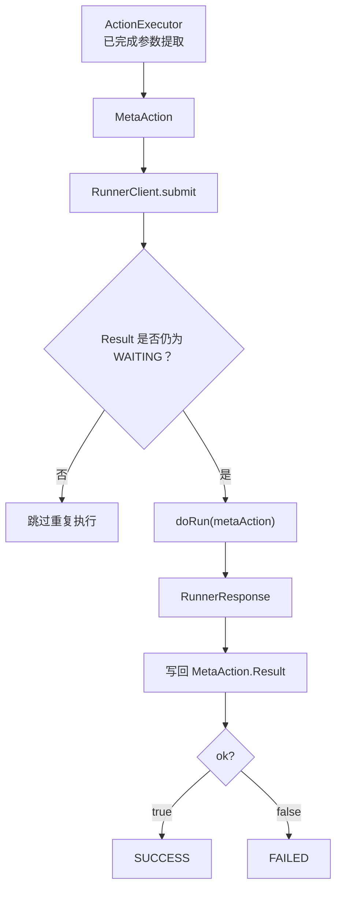
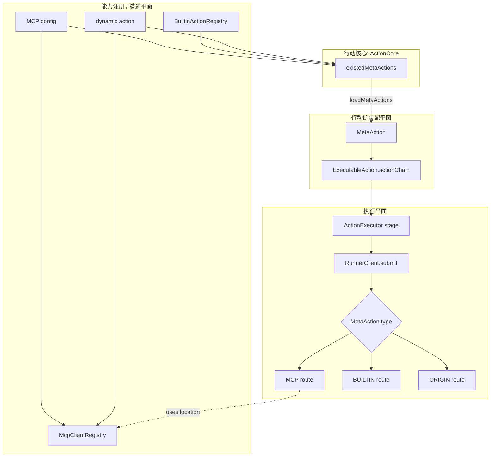
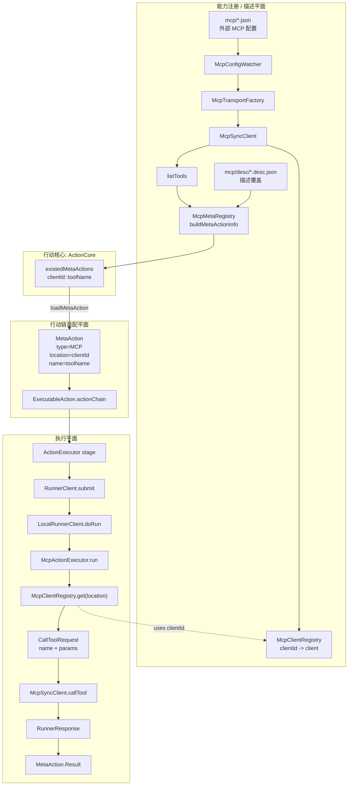
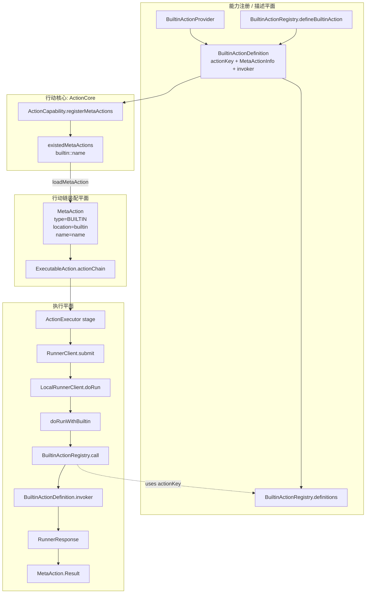
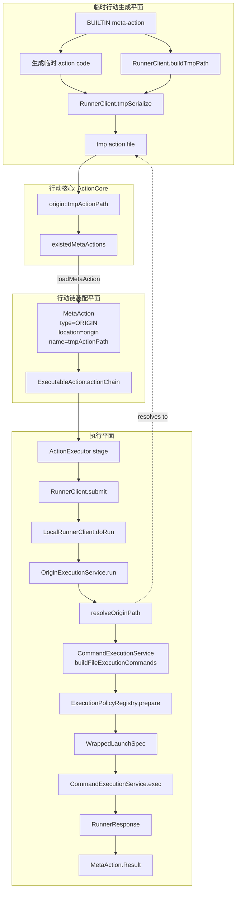
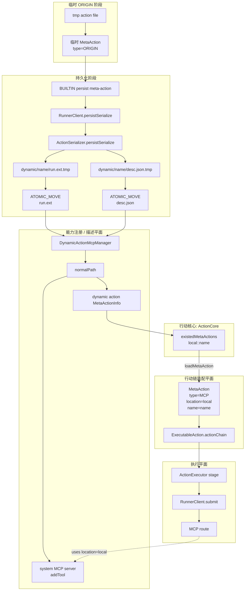

# RunnerClient 与本地路由

本文说明 `RunnerClient`、`LocalRunnerClient` 以及 `MCP` / `BUILTIN` / `ORIGIN` 三类执行路由。

## MetaAction 执行通道

`MetaAction` 当前有三类执行通道：

| 类型 | 说明 |
|---|---|
| `MCP` | 通过 MCP client 调用外部工具能力 |
| `BUILTIN` | 调用 JVM 内部注册的内置行动 |
| `ORIGIN` | 执行本地或持久化的 action 文件 |

行动链只保存 `MetaAction`，不直接关心底层通道。执行时，`RunnerClient` 根据 `MetaAction` 的类型和位置信息把调用交给对应实现。

这种设计把“行动链结构”和“行动运行方式”分开：上层只需要知道 action key，底层负责解释这个 key 如何运行。

## RunnerClient

`RunnerClient` 是执行器与底层行动运行环境之间的边界。`ActionExecutor` 完成参数提取后，只需要把 `MetaAction` 提交给 runner；runner 负责确认该行动是否仍处于可执行状态、调用具体执行通道，并把结果统一写回 `MetaAction.Result`。



这个边界让 `ActionExecutor` 不需要感知 MCP、ORIGIN、BUILTIN 的差异。对执行器来说，单个 `MetaAction` 只有“提交、等待结果、记录历史”这一种语义。

`RunnerClient` 还抽象了 action 文件序列化能力。临时 action 和持久化 action 的落盘位置、命名和文件结构由 runner 管理，上层只通过 runner 暴露的接口生成临时路径或持久化 action。

## LocalRunnerClient

`LocalRunnerClient` 是当前主要的 runner 实现。它不只是本地执行器，还负责初始化本地 action 基础设施。

启动时，它会建立本地 action 目录结构：

```text
action/
  tmp/
  dynamic/
  mcp/
    desc/
```

这些目录分别承担不同角色：

| 目录 | 作用 |
|---|---|
| `tmp/` | 临时 action 文件目录，不进入长期能力注册 |
| `dynamic/` | 持久化动态 action 目录，由 watcher 转换为本地 MCP tool |
| `mcp/` | 外部 MCP 配置目录 |
| `mcp/desc/` | MCP tool 描述覆盖目录 |

`LocalRunnerClient` 初始化时还会启动三组基础设施：

- `McpMetaRegistry` + `McpDescWatcher`：维护 MCP tool 的描述资源和描述覆盖。
- `DynamicActionMcpManager`：把 `dynamic/` 下的本地 action 包装成本进程 MCP tool。
- `McpConfigWatcher`：监听外部 MCP 配置，动态注册或移除 MCP client。

因此，`LocalRunnerClient` 同时承担两个角色：一方面是 `MetaAction` 的本地执行入口，另一方面是本地行动能力集合的维护入口。

三类路由共享同一组平面：能力注册 / 描述平面负责让能力进入系统，`ActionCore` 维护可用能力表，行动链装配平面把 action key 加载成 `MetaAction`，执行平面再按 `MetaAction.type` 分流到具体 route。



## 执行路由：MCP

`MCP` 路由用于调用外部 MCP server 暴露的工具能力。外部 MCP 配置被加载为 MCP client，tool 元信息被写入 `ActionCore.existedMetaActions`，随后 planner / evaluator 可以把这些 tool 作为 `MetaAction(type=MCP)` 放入行动链。



在这个通道中，`MetaAction.location` 表示 MCP client id，`MetaAction.name` 表示 tool name。执行阶段通过 `location` 回到 `McpClientRegistry` 找到已注册 client，再用 `name` 和参数调用 tool。

## 执行路由：BUILTIN

`BUILTIN` 路由用于承载智能体内部向行动系统暴露的能力集合。系统内部能力可以通过 `BuiltinActionProvider` 或 `BuiltinActionRegistry` 注册为 `MetaActionInfo`，从而进入 planner / evaluator / executor 共享的行动链模型。

这些内部能力覆盖的范围可以很宽，包括命令执行、capability layer 操作、临时 meta action 创建与持久化、主动 turn等。`BUILTIN` 的意义是把这些内部能力也组织成 `MetaAction`，让它们与外部 MCP tool、临时 action 一样接受行动提取、评估、编排和执行。



`BuiltinActionRegistry` 是当前的承载实现。它负责保存 builtin action 定义，把对应 `MetaActionInfo` 注册到 action capability，并在执行时根据 action key 和参数调用具体能力。

## 执行路由：ORIGIN

`ORIGIN` 路由用于执行临时 meta action 的本地文件形态。临时 meta action 通常由某个 builtin meta-action 创建：系统内部能力先生成 action 文件和对应 `MetaAction`，随后通过 `ORIGIN` 路由运行该文件。



`ORIGIN` 表示临时能力的执行阶段：action 文件有本地路径，执行时由 `OriginExecutionService` 解析文件位置、组合 launcher 与参数，并交给执行策略和命令执行服务处理。

临时 meta action 可以过期，也可以被主动持久化。持久化后，它会进入 dynamic action 流程，成为可长期复用的动态行动能力。



因此，`ORIGIN`、dynamic action 和 `MCP` 可以组成一条能力生命周期：内部能力创建临时 meta action，临时阶段通过 `ORIGIN` 执行，持久化后转为 dynamic action，并由系统创建的 MCP server 统一管理。
