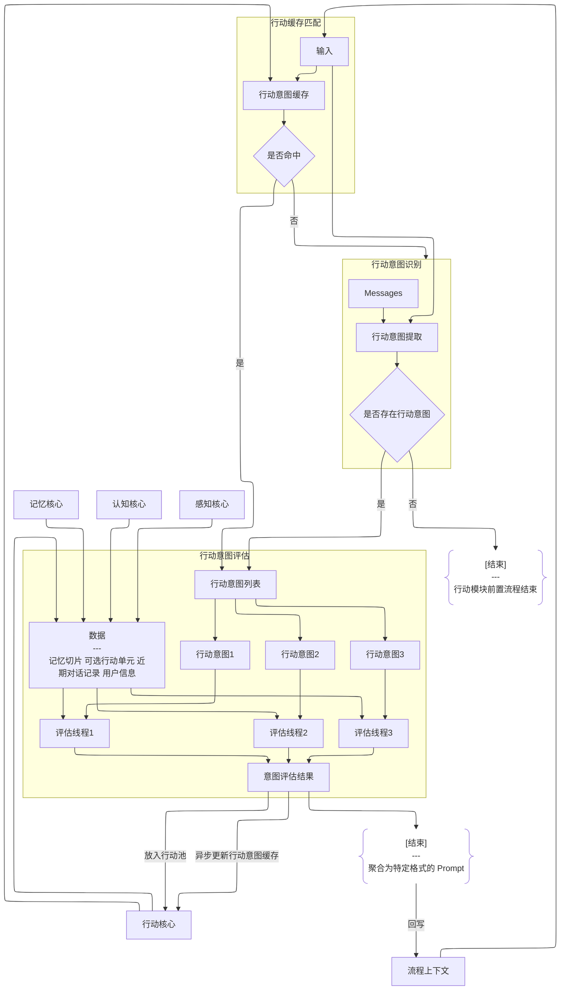

# 流程参考: 行动模块
> 行动模块当前仍在推进中，当前展示的为设想中或者当前阶段的流程图，可能与最终实现存在差异

## 前置模块
### 行动规划模块: [ActionPlanner](../../Partner-Main/src/main/java/work/slhaf/partner/module/modules/action/planner/ActionPlanner.java)

