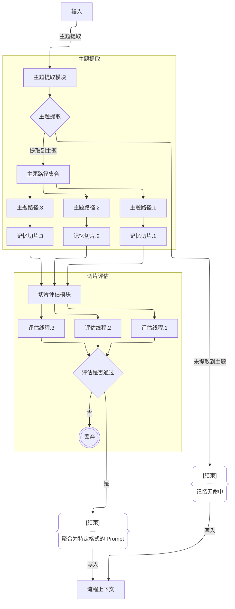
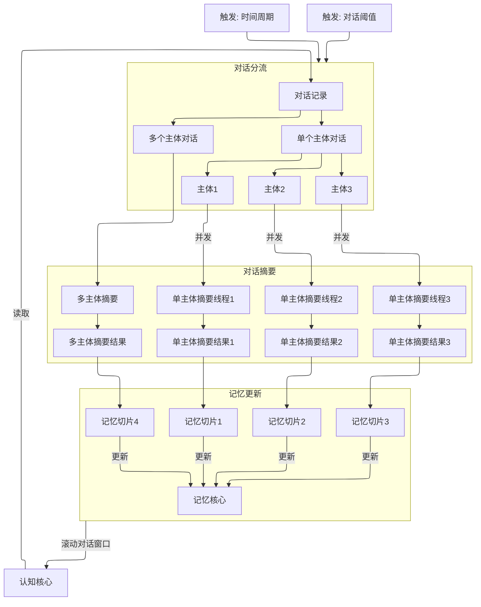

# 流程参考: 记忆模块
> 仅展示大致流程，缓存命中、持久化等内容在下方流程图中尚未体现

## 前置模块: [MemorySelector](../../Partner-Main/src/main/java/work/slhaf/partner/module/modules/memory/selector/MemorySelector.java)

```mermaid
---
config:
  layout: elk
  elk:
    nodePlacementStrategy: LINEAR_SEGMENTS
---

flowchart TD
    direction TB
    
    Input[输入] --> |主题提取| Extractor
    subgraph TE [主题提取]
        Extractor[主题提取模块] --> Extract{主题提取}
        Extract --> |提取到主题| TopicSet[主题路径集合]

        TopicSet --> TopicPath1[主题路径.1] --> Slice1[记忆切片.1]
        TopicSet --> TopicPath2[主题路径.2] --> Slice2[记忆切片.2]
        TopicSet --> TopicPath3[主题路径.3] --> Slice3[记忆切片.3]
    end

    subgraph  SE [切片评估]

        Evaluator[切片评估模块]

        Slice1 --> Evaluator --> Thread1[评估线程.1] --> Evaluated{评估是否通过}
        Slice2 --> Evaluator --> Thread2[评估线程.2] --> Evaluated{评估是否通过}
        Slice3 --> Evaluator --> Thread3[评估线程.3] --> Evaluated{评估是否通过}
        Evaluated --> |否| Throwed
    end

    Context[流程上下文]
    Extract --> |未提取到主题| ResultEmpty
    Evaluated --> |是| ResultNormal
    ResultEmpty --> |写入| Context
    ResultNormal --> |写入| Context

    ResultEmpty@{shape: braces, label: "[结束]<br/>---<br/>记忆无命中"}
    ResultNormal@{shape: braces, label: "[结束]<br/>---<br/>聚合为特定格式的 Prompt"}
    Throwed@{ shape: dbl-circ, label: "丢弃" }
```

### 后置

```mermaid
---
config:
  layout: elk
  elk:
    nodePlacementStrategy: LINEAR_SEGMENTS
---

flowchart TD
    direction TB

    Trigger.Time[触发: 时间周期] --> MT
    Trigger.Threshold[触发: 对话阈值] --> MT

    CognationCore --> |读取| Messages
    subgraph MT [对话分流]
        Messages[对话记录] --> Single[单个主体对话]
        Single --> Single1[主体1]
        Single --> Single2[主体2]
        Single --> Single3[主体3]

        Messages[对话记录] --> Multi[多个主体对话]
    end

    subgraph MS [对话摘要]
        Single1 --> |并发| SSum1[单主体摘要线程1] --> SSResult1[单主体摘要结果1]
        Single2 --> |并发| SSum2[单主体摘要线程2] --> SSResult2[单主体摘要结果2]
        Single3 --> |并发| SSum3[单主体摘要线程3] --> SSResult3[单主体摘要结果3]

        Multi --> MSum[多主体摘要] --> MSResult[多主体摘要结果]
    end

    subgraph MU[记忆更新]
        MemoryCore[记忆核心]
        SSResult1 --> Slice1[记忆切片1] --> |更新| MemoryCore
        SSResult2 --> Slice2[记忆切片2] --> |更新| MemoryCore
        SSResult3 --> Slice3[记忆切片3] --> |更新| MemoryCore

        MSResult --> Slice4[记忆切片4] --> |更新| MemoryCore

    end

    MU --> |滚动对话窗口| CognationCore

    CognationCore[认知核心]
```