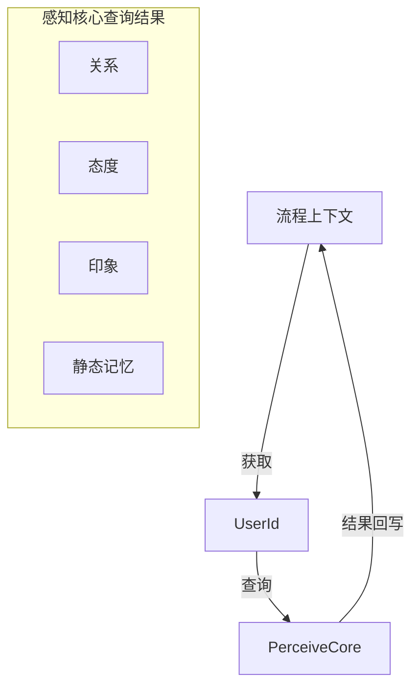
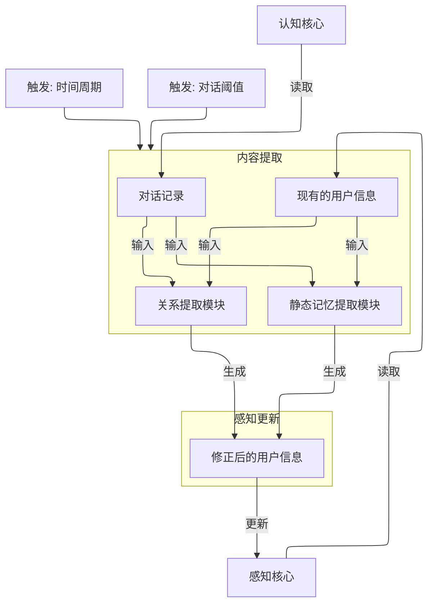

# 流程参考: 感知模块
> 相较于其他模块，目前的感知模块实际上流程非常简单，但后续或将添加一些新的内容
> 此外，其后置模块实际上与 [记忆模块](./memory.md) 中的后置模块为并发执行，且都为后台任务

## 前置模块: [PerceiveSelector](../../Partner-Main/src/main/java/work/slhaf/partner/module/modules/perceive/selector/PerceiveSelector.java)

## 后置模块: [PerceiveUpdater](../../Partner-Main/src/main/java/work/slhaf/partner/module/modules/perceive/updater/PerceiveUpdater.java)
