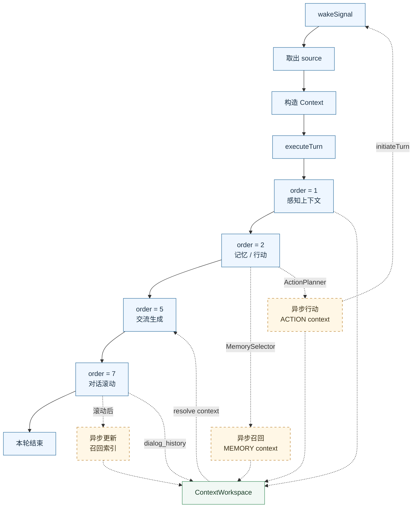

# 整体架构与运行流

Partner 是一个多模块、异步协作的智能体运行时。

为平衡扩展性与组件间一致性，Partner 内部具备一个小型的 DI 容器，以及多个具备配套接口的注册中心。它们会在 Agent 启动时有序拉起，并将各自的关闭 Hook 注册进名为 `AgentContext` 的对象中，在 JVM 收到终止信号时有序触发各个 shutdown hook 进行关闭。

本文是架构文档入口，用于说明核心文档的阅读顺序和主题边界。下方总览图描述 Partner-Core 中感知、记忆、行动、交流与对话滚动模块在一次运行轮次中的协作关系。

## 阅读顺序

- [Agent 启动流程](startup.md)：说明 `Agent.launch()` 的外层启动顺序。
- [Agent 注册链](register-chain.md)：说明 `AgentRegisterFactory.launch()` 如何扫描、校验、实例化并注入组件与 Capability。
- [Runtime 输入与模块调度](runtime-flow.md)：说明 Gateway 输入如何进入 `AgentRuntime`，以及 Running module 如何被调度。
- [关闭流程](shutdown.md)：说明 JVM shutdown hook、生命周期关闭钩子与 `@Shutdown` 方法的执行顺序。

## 核心概念

### AgentContext

`AgentContext` 是注册链和运行时之间的共享容器，主要保存：

- `modules`：扫描并实例化得到的 Running / Sub / Standalone 模块。
- `capabilities`：Capability 动态代理、CapabilityCore 实例和方法路由信息。
- `additionalComponents`：非模块类型的 `@AgentComponent` 实例。
- `shutdownHooks`：从 `@Shutdown` 方法收集得到的关闭钩子。
- `preShutdownHooks` / `postShutdownHooks`：框架与应用显式注册的生命周期关闭钩子。

### Configurable

`Configurable` 用于向 `ConfigCenter` 注册配置入口。启动阶段会先注册框架内置和应用传入的 Configurable；随后在 `ConfigCenter.initAll()` 阶段读取配置并触发各自的初始化逻辑。

### Gateway

Gateway 是外部输入协议与 Partner Runtime 之间的边界。Gateway 将协议输入转换成 `RunningFlowContext`，再提交给 `AgentRuntime`。响应输出也通过 `ResponseChannel` 抽象回到具体 Gateway。

### Running Module

Running module 是 `AgentRuntime` 直接调度的模块类型。它们按 `module.order()` 分组执行：order 小的组先执行，同一 order 内并发执行。

## Partner-Core 模块链路总览

### 图例说明

- 图中蓝色节点表示本轮 `PartnerRunningFlowContext` 在 `AgentRuntime.executeTurn()` 中的同步主链路。`AgentRuntime` 会按 `module.order()` 分组调度 Running module：order 较小的模块组先执行，同一 order 内的模块并发执行。

- 黄色节点表示模块内部启动的异步任务。它们不会阻塞当前主链路继续向后执行，因此异步任务写入的 `MEMORY context` 或 `ACTION context` 不保证一定会被本轮 `CommunicationProducer` 读取；如果写入晚于本轮交流生成，则会影响后续 turn。

- 绿色节点表示 `ContextWorkspace`。感知、记忆、行动、对话滚动等模块会向其中注册不同 focused domain 的上下文块；`CommunicationProducer` 在生成回复前统一 resolve `COGNITION / ACTION / MEMORY / PERCEIVE` 相关上下文，并与对话历史和当前输入一起组装成模型输入。

### 模块链路说明

- `PerceiveMonitor` 和 `SystemStatsMonitor` 位于 order 1，主要负责刷新交互时间、采集系统状态，并写入 `PERCEIVE` 域上下文。

- `MemorySelector` 和 `ActionPlanner` 位于 order 2。`MemorySelector` 在同步阶段收集本轮输入，并尝试启动异步 recall worker；实际记忆召回、候选切片评估和 `activated_memory_slices` 写入发生在异步任务中。`ActionPlanner` 在同步阶段提取行动意图并写入初始 ACTION 状态，后续评估、确认、执行或调度由异步任务继续处理。

- `CommunicationProducer` 位于 order 5，是本轮对外交流的主要出口。它读取 `ContextWorkspace`、当前保留的 conversation history 和本轮输入，生成回复并更新聊天轨迹。

- `DialogRolling` 位于 order 7，用于在对话历史达到阈值后执行压缩、总结和滚动。滚动结果会写入记忆系统，并向 `ContextWorkspace` 注册 `dialog_history`，供后续 turn 使用。

### 异步回流

`ActionPlanner` 的异步任务可能通过 `initiateTurn()` 重新提交输入，从而触发新的 `wakeSignal`。这不是当前 turn 的下一步，而是后续 turn 的入口。也就是说，图中的虚线回流表示“可能产生新的运行轮次”，不是当前同步链路的一部分。