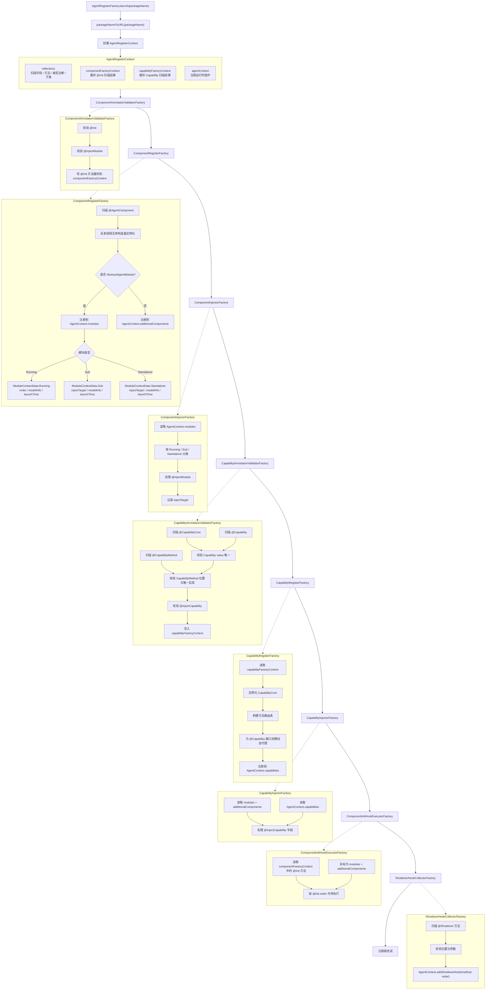
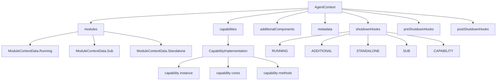

# Agent 注册链

本文说明 `AgentRegisterFactory.launch(packageName)` 内部的注册链。注册链的职责是基于应用包与外部模块目录扫描结果，完成组件、模块、Capability、生命周期方法和关闭方法的注册。

`AgentRegisterContext` 是注册链上下文。它持有 `Reflections` 扫描器，以及供各阶段读写的 `ComponentFactoryContext`、`CapabilityFactoryContext` 和全局 `AgentContext`。

## AgentContext

`AgentContext` 是注册链的主要产物。它不是单轮对话上下文，而是运行时组件注册结果和关闭逻辑的集中容器。

