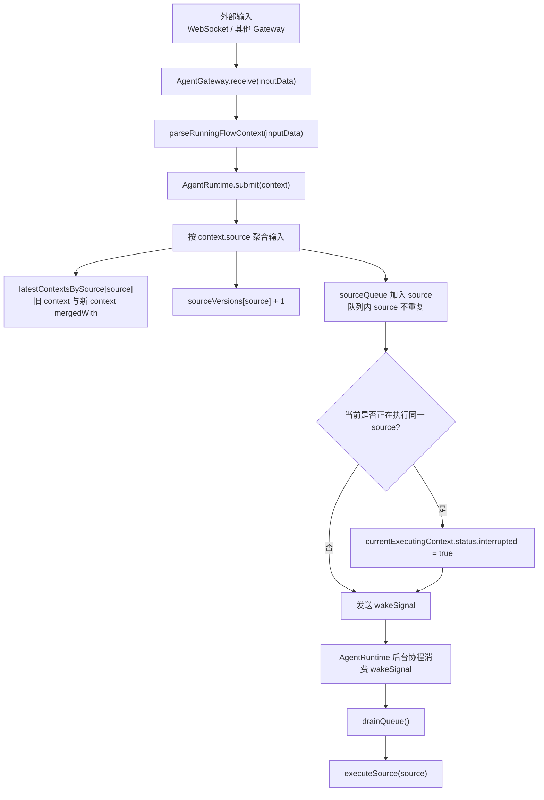
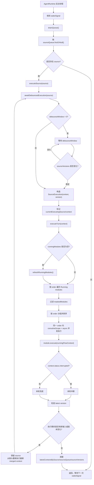
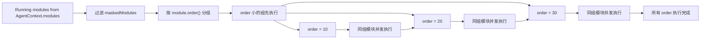

# Runtime 输入与模块调度

本文说明外部输入如何经由 Gateway 进入 `AgentRuntime`，以及 `AgentRuntime` 如何按 `source` 聚合输入、去重、debounce 并调度 Running module。

## Gateway 与输入提交

Gateway 负责把外部输入转换成 `RunningFlowContext`，再提交给 `AgentRuntime`。`AgentRuntime` 不直接感知 WebSocket 等具体输入协议。

## 模块运行时

`AgentRuntime` 采用按 `source` 聚合的异步执行模型。同一个 `source` 的连续输入会合并为最新的 `RunningFlowContext`；如果新输入到达时该 `source` 正在执行，当前上下文会被标记为 interrupted，当前轮结束后 runtime 会从 Running module 链头重新执行最新合并后的上下文。

Running module 的执行顺序由 `module.order()` 决定。order 较小的组先执行，同一 order 内的模块并发执行。

