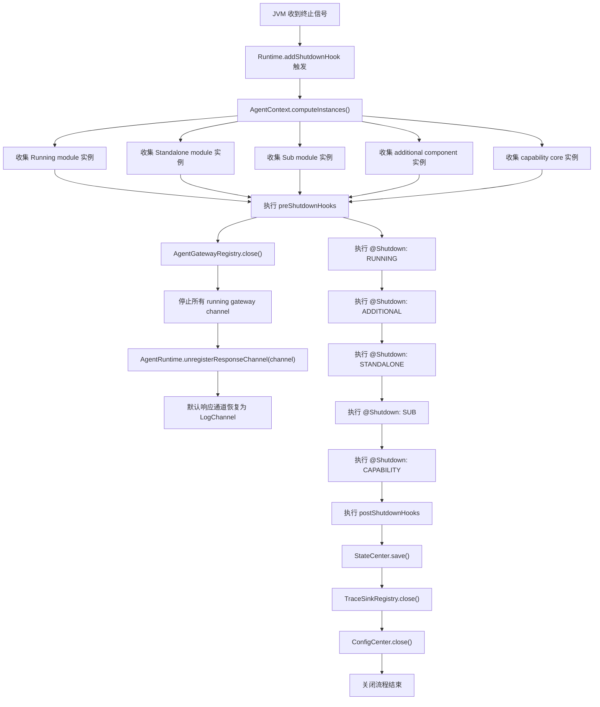

# 关闭流程

本文说明 Partner 在 JVM 终止时的关闭顺序。

关闭阶段由 `AgentContext` 安装到 JVM 的 shutdown hook 统一触发。生命周期 Hook 与注解式 `@Shutdown` Hook 是两套机制：前者用于框架级收尾，如关闭 Gateway、保存状态、关闭配置监听；后者用于模块、额外组件与 Capability Core 自己声明的关闭逻辑。

当前关闭顺序为：

1. `preShutdownHooks`
2. `RUNNING`
3. `ADDITIONAL`
4. `STANDALONE`
5. `SUB`
6. `CAPABILITY`
7. `postShutdownHooks`

