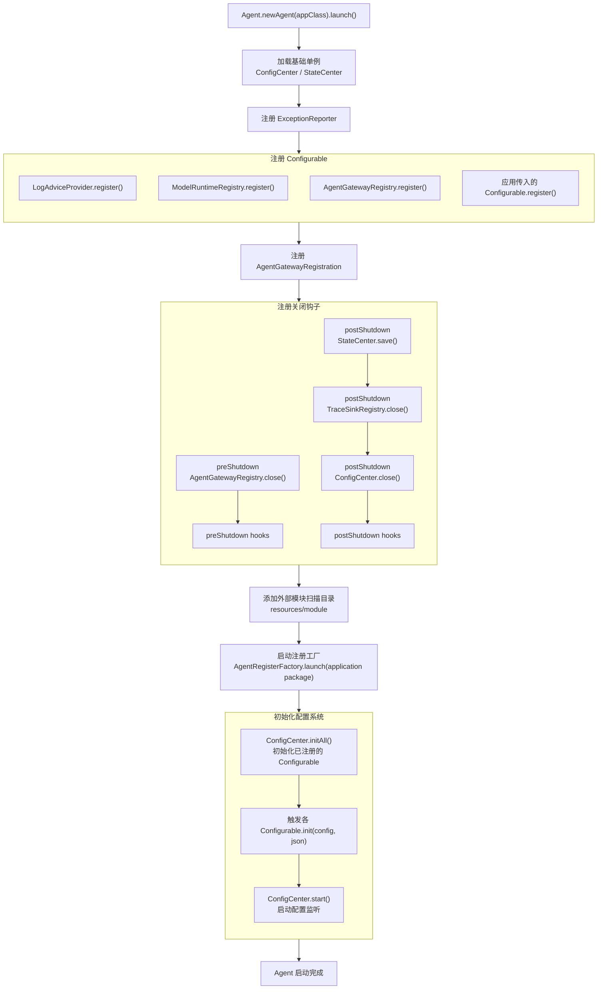

# Agent 启动流程

本文说明 `Agent.newAgent(appClass).launch()` 的外层启动顺序。

`Agent.launch()` 负责拉起基础单例、注册配置参与者、注册 Gateway、安装关闭钩子、添加外部模块目录，并启动注册工厂。组件扫描、模块实例化和能力注册的细节见 [注册链](register-chain.md)。

Gateway 的实际 `launch()` 不在 `AgentGatewayRegistration.register()` 中直接发生。Gateway registration 只把可用通道注册到 `AgentGatewayRegistry`；真正的通道创建、启动和默认响应通道设置发生在 `ConfigCenter.initAll()` 阶段，由 `AgentGatewayRegistry.init()` 根据 `gateway.json` 执行。
