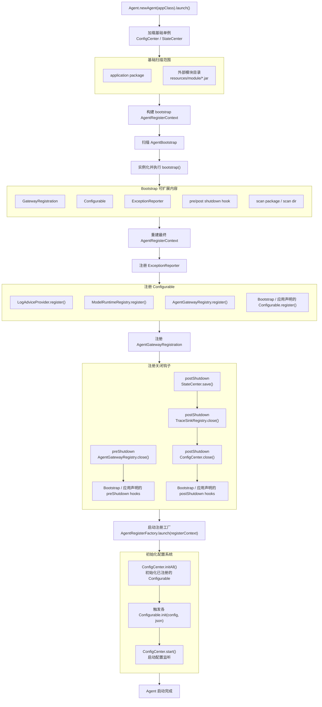

# Agent 启动流程

本文说明 `Agent.newAgent(appClass).launch()` 的外层启动顺序。

`AgentApp.launch()` 负责拉起基础单例、构建扫描上下文、执行启动前扩展、注册配置参与者、注册 Gateway、安装关闭钩子，并把最终 `AgentRegisterContext` 交给注册工厂。组件扫描、模块实例化和能力注册的细节见 [注册链](register-chain.md)。

## 启动前扩展：AgentBootstrap

`Agent.AgentBootstrap` 是启动前扩展点。它会在正式组件注册链执行前被扫描、实例化并执行 `boot()`。

Bootstrap 实现类需要继承 `Agent.AgentBootstrap`，并提供 `Agent.AgentApp` 构造器：

```java
public final class PartnerAgentBootstrap extends Agent.AgentBootstrap {

    public PartnerAgentBootstrap(Agent.AgentApp agentApp) {
        super(agentApp);
    }

    @Override
    protected void bootstrap() {
        addGatewayRegistration(WebSocketGatewayRegistration.INSTANCE);
        addConfigurable(new VectorClientRegistry());
    }
}
```

Bootstrap 可用于声明启动前基础设施扩展：

- `addGatewayRegistration(...)`
- `addConfigurable(...)`
- `addExceptionReporter(...)`
- `addPreShutdownHook(...)`
- `addPostShutdownHook(...)`
- `addScanPackage(...)`
- `addScanDir(...)`

Bootstrap 按 `order()` 升序执行，默认 `order()` 为 `0`。

## 外层启动顺序


```mermaid
flowchart TD
    A["Agent.newAgent(appClass).launch()"] --> B["加载基础单例<br/>ConfigCenter / StateCenter"]

    B --> C["准备基础扫描范围"]

    subgraph C["基础扫描范围"]
        direction TB
        C1["application package"]
        C2["外部模块目录<br/>resources/module/*.jar"]
    end

    C --> D["构建 bootstrap AgentRegisterContext"]
    D --> E["扫描 AgentBootstrap"]
    E --> F["实例化并执行 bootstrap()"]

    F --> G["Bootstrap 扩展 AgentApp"]

    subgraph G["Bootstrap 可扩展内容"]
        direction TB
        G1["GatewayRegistration"]
        G2["Configurable"]
        G3["ExceptionReporter"]
        G4["pre/post shutdown hook"]
        G5["scan package / scan dir"]
    end

    G --> H["重建最终 AgentRegisterContext"]

    H --> I["注册 ExceptionReporter"]

    I --> J

    subgraph J["注册 Configurable"]
        direction TB
        J1["LogAdviceProvider.register()"]
        J2["ModelRuntimeRegistry.register()"]
        J3["AgentGatewayRegistry.register()"]
        J4["Bootstrap / 应用声明的 Configurable.register()"]
    end

    J --> K["注册 AgentGatewayRegistration"]

    K --> L

    subgraph L["注册关闭钩子"]
        direction TB
        L1["preShutdown<br/>AgentGatewayRegistry.close()"]
        L2["Bootstrap / 应用声明的 preShutdown hooks"]
        L3["postShutdown<br/>StateCenter.save()"]
        L4["postShutdown<br/>TraceSinkRegistry.close()"]
        L5["postShutdown<br/>ConfigCenter.close()"]
        L6["Bootstrap / 应用声明的 postShutdown hooks"]
        L1 --> L2
        L3 --> L4 --> L5 --> L6
    end

    L --> M["启动注册工厂<br/>AgentRegisterFactory.launch(registerContext)"]

    M --> N

    subgraph N["初始化配置系统"]
        direction TB
        N1["ConfigCenter.initAll()<br/>初始化已注册的 Configurable"]
        N2["触发各 Configurable.init(config, json)"]
        N3["ConfigCenter.start()<br/>启动配置监听"]
        N1 --> N2 --> N3
    end

    N --> O["Agent 启动完成"]
```

## 扫描上下文

`AgentApp` 现在负责维护扫描输入并构建 `AgentRegisterContext`。

默认扫描输入包括：

- `applicationClass.getPackageName()` 对应的 classpath package URL
- `ConfigCenter.INSTANCE.getPaths().getResourcesDir().resolve("module")` 下的 `*.jar`

启动时会构建两次扫描上下文：

1. **bootstrap context**：用于发现 `AgentBootstrap`。
2. **final register context**：在 `AgentBootstrap.boot()` 可能追加 scan package / scan dir 后重建，用于后续 `AgentRegisterFactory.launch(registerContext)`。

`AgentRegisterFactory` 现在只负责执行注册链。它接收已经构建好的 `AgentRegisterContext`，不再是主启动链路里扫描上下文的拥有者。旧的 `launch(packageName)` 仍可作为兼容入口使用。

## Gateway 启动时机

Gateway 的实际 `launch()` 不在 `AgentGatewayRegistration.register()` 中直接发生。Gateway registration 只把可用通道注册到 `AgentGatewayRegistry`；真正的通道创建、启动和默认响应通道设置发生在 `ConfigCenter.initAll()` 阶段，由 `AgentGatewayRegistry.init()` 根据 `gateway.json` 执行。
