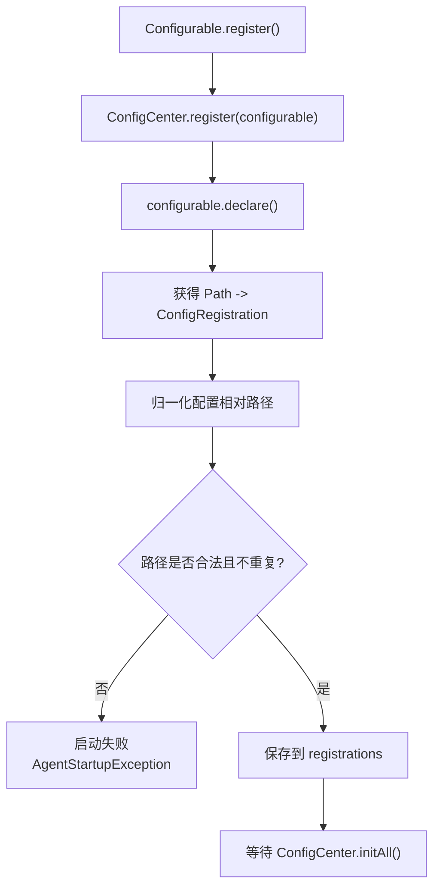
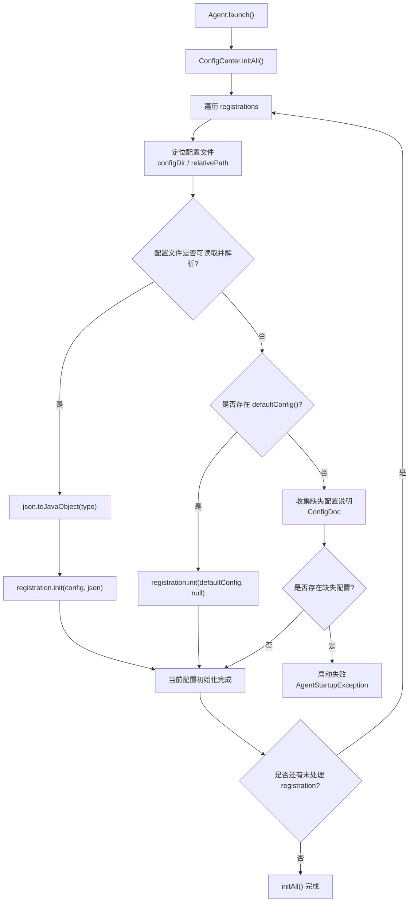
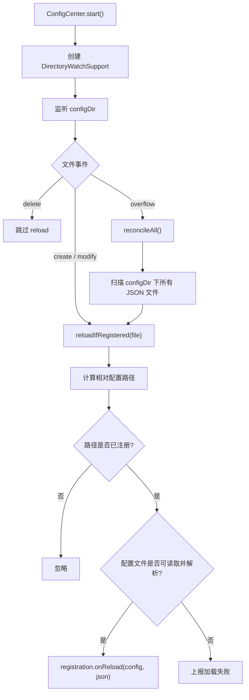

# 配置中心

本章主要用于介绍 Partner 配置中心的工作机制。在 Partner 中，所有配置都通过 `ConfigCenter`、`Configurable` 以及配套的 `ConfigRegistration` 承担。配置中心在启动阶段完成配置初始化，并在启动文件监听后为已注册配置提供热重载能力。

> 具体配置文件、字段含义和示例，参考 [配置项说明](config-reference.md)。

## 运行流程

`ConfigCenter` 的生效过程分为三个阶段：配置入口注册、启动期初始化、运行期监听与重载。

### 配置入口注册

`Configurable` 只负责声明自己管理哪些配置文件，以及每个配置文件对应哪个 `ConfigRegistration`。注册阶段不会读取配置文件，也不会触发配置生效。

需要注意，`ConfigCenter.register(configurable)` 只能在监听启动前调用。`ConfigCenter.start()` 之后再注册新的 `Configurable` 会被视为启动期错误。

### 启动期初始化

启动初始化发生在 `Agent.launch()` 的后半段。此时框架内置和应用传入的 `Configurable` 已完成注册，`ConfigCenter.initAll()` 会遍历所有已注册的 `ConfigRegistration`，按声明的相对路径从配置目录读取 JSON 文件。

读取成功时，JSON 会被转换为对应的 `Config` 类型，并传入 `ConfigRegistration.init(config, json)`。读取失败或文件不存在时，如果 registration 提供了 `defaultConfig()`，则使用默认配置执行初始化；如果没有默认配置，则启动失败，并根据配置类型上的 `ConfigDoc` 输出缺失配置说明。

### 运行期监听与重载

`ConfigCenter.start()` 会在启动初始化完成后启动配置目录监听。运行期监听只处理已经注册过的配置路径，不会为新路径创建 registration。

运行时重载发生在 `ConfigCenter.start()` 之后。配置中心会监听配置目录，对创建和修改事件执行 `reloadIfRegistered(file)`。只有已注册路径对应的 JSON 文件会被处理，解析成功后调用 `ConfigRegistration.onReload(config, json)`。删除事件不会触发默认配置回退，当前实现只记录并跳过 reload；监听溢出时会通过 `reconcileAll()` 扫描配置目录中所有 JSON 文件，并对已注册配置重新执行 reload。
