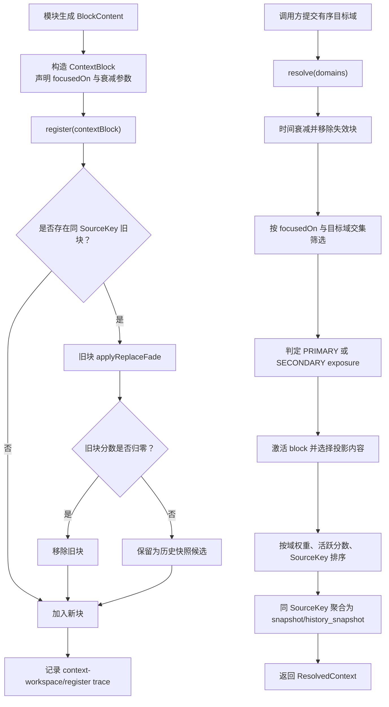

# 上下文工作空间

本文介绍 Partner 中 `ContextWorkspace` 机制的设计思路与工作流程。

Partner 是一个多模块、异步协作的智能体运行时，因此，“如何使得上下文能够在各个模块中有序参与、有序共享信息”，是维持智能体个体感、前后一致性的重要问题。

`ContextWorkspace` 将不同来源的上下文建模为按域划分、按域查询的 `ContextBlock`。一个 `ContextBlock` 持有三种展开级别的 `BlockContent`，支持时间衰减与替代衰减的活跃分数，并声明它本身对应的“聚焦域”。调用方在需要上下文时，不直接读取所有历史状态，而是向 `ContextWorkspace` 提交一组目标域，由工作空间负责筛选、激活、排序、聚合与渲染。

## 核心概念

**什么是“域”**

- 域是一次上下文读取请求的目标语境，表示“这次调用方是为了哪类工作来索取上下文”。当前实现中域由 `ContextBlock.FocusedDomain` 枚举表示，包括 `ACTION`、`MEMORY`、`PERCEIVE`、`COGNITION` 与 `COMMUNICATION`。
- `resolve(domains)` 接收的是一个有序域列表，而不是无序集合。列表中的第一个域会被视为主域；越靠前的域权重越高。工作空间会把域顺序转换为线性权重，并把匹配到多个目标域的 block 累积加权。
- 域本身不是模块所有权，也不是存储分区。它更像一次读取上下文时的关注面：例如行动模块可以请求 `ACTION` 相关上下文，也可以在同一次请求中附带 `MEMORY` 或 `COGNITION` 作为辅助关注面。

**什么是“聚焦域”**

- 聚焦域是 `ContextBlock` 生产方对该上下文块用途的声明，由 `focusedOn: Set<FocusedDomain>` 表示。它回答的是：“这个 block 对哪些语境有用？”
- 当调用方执行 `resolve(domains)` 时，工作空间会计算 `block.focusedOn` 与目标域列表的交集。没有交集的 block 不会进入本次结果；有交集的 block 才会继续参与激活、投影与排序。
- 如果 block 命中了本次请求的第一个域，它会以 `PRIMARY` exposure 参与渲染；否则即使命中了后续辅助域，也只会以 `SECONDARY` exposure 参与渲染。这个区分决定了 block 最终能展开到多详细。
- 同一个 block 可以聚焦多个域。例如某段 memory 既能支持 `MEMORY`，也能支持 `ACTION`，它就可以在行动决策和记忆整理两类请求中被激活。

**“展开层级”与“衰减分数”如何生效**

- 每个 `ContextBlock` 内部有一个 `activationScore`，初始值为 `100.0`。当分数降到 `0.0` 时，该 block 会从工作空间中移除。
- 分数会通过两类机制变化：其一是时间衰减，`timeFadeFactor` 按分钟折算到经过的秒数；其二是替代衰减，当新的 block 与旧 block 具有相同 `SourceKey(blockName, source)` 时，旧 block 会扣除 `replaceFadeFactor`。
- 展开层级由当前活跃分数决定：低于 `30.0` 时为 `ABSTRACT`，低于 `70.0` 时为 `COMPACT`，否则为 `FULL`。
- block 持有三份内容投影：`blockContent` 是完整内容，`compactBlock` 是压缩内容，`abstractBlock` 是摘要内容。缺省情况下，`compactBlock` 退化为完整内容，`abstractBlock` 退化为压缩内容。
- `PRIMARY` exposure 至少会渲染到 compact：当 block 处于 full 层级时输出 `blockContent`，处于 compact 或 abstract 层级时输出 `compactBlock`。
- `SECONDARY` exposure 不会渲染 full：当 block 处于 abstract 层级时输出 `abstractBlock`，处于 compact 或 full 层级时输出 `compactBlock`。
- 每次命中目标域后，block 会根据 exposure 被激活。主域激活更强，辅助域激活更弱；同时实现通过 ceiling 限制层级跃迁，避免一个已经衰减到 abstract 的 block 在一次辅助命中中直接升回 compact 或 full。

## SourceKey 与同源快照

`ContextBlock` 的同源判断只看 `blockName` 与 `source`，也就是 `SourceKey(blockName, source)`。这意味着两个 block 即使内容不同，只要来自同一个逻辑来源，就会被视为同源上下文。

当注册新的同源 block 时，旧 block 不会立即被无条件删除，而是先执行替代衰减：

- 如果旧 block 衰减后分数归零，它会被移除。
- 如果旧 block 仍有活跃分数，它会保留下来，后续在 resolve 时可能与新 block 聚合为同一个结果块。
- 新 block 总是会被加入工作空间，代表该来源的最新状态。

这种设计允许上下文同时表达“最新快照”和“仍有价值的历史快照”，但不会让同源历史无限堆积；旧内容会随着替代衰减和时间衰减自然退出。

## 解析与排序

`resolve(domains)` 是 `ContextWorkspace` 的核心读取流程。它不会简单返回所有 block，而是执行一组选择规则：

1. 空域列表直接返回空结果。
2. 根据目标域顺序计算域权重，第一个域权重最高。
3. 对工作空间内所有 block 先执行时间衰减，分数归零的 block 立即移除。
4. 只保留 `focusedOn` 与目标域有交集的 block。
5. 根据是否命中主域判定 `PRIMARY` 或 `SECONDARY` exposure。
6. 对命中的 block 执行激活，并使用 exposure 选择最终渲染的投影内容。
7. 结果先按累积域权重降序，再按活跃分数降序排序；分数相同或权重相同时，再用 `blockName` 与 `source` 提供稳定顺序。
8. 排序后按 `SourceKey` 分组：单个 block 直接输出，多个同源 block 聚合输出。

聚合输出由 `AggregatedBlockContent` 完成。它会把同源 block 包装成一个 XML block，其中活跃分数最高的渲染结果标记为 `<snapshot>`，其他结果标记为 `<history_snapshot>`。聚合块的 urgency 取自已渲染投影中的最高 urgency，而不是无条件取完整内容的 urgency。

## 注册、过期与追踪

`ContextWorkspace` 提供两个状态变更入口：

- `register(contextBlock)`：注册新的上下文块，并对同源旧块执行替代衰减。
- `expire(blockName, source)`：按 `SourceKey` 移除所有同源上下文块。

每次注册或过期导致状态变化时，工作空间会写入 `TraceRecorder`，事件名为 `context-workspace`。记录内容包括本次 action、受影响的 source key，以及当前工作空间中所有 block 的快照渲染内容。这让上下文系统的状态变化可以被外部观察和调试。

## 工作流程

## 设计取向

`ContextWorkspace` 的重点不是保存尽可能多的历史，而是在多模块智能体运行时中提供一个可衰减、可聚焦、可解释的上下文选择层。模块只需要发布带有语义域声明的 `ContextBlock`；消费方只需要声明本次要处理的目标域。两者之间的筛选、降噪、投影、历史聚合与追踪，由工作空间统一承担。

这样可以避免两个常见问题：

- 上下文过度展开：所有模块都读取完整历史，导致 prompt 噪音和状态漂移。
- 上下文过早丢失：新状态覆盖旧状态后，仍有短期价值的历史信息无法参与后续推理。

通过活跃分数、聚焦域和 exposure-specific projection，`ContextWorkspace` 在“保留历史”和“压缩上下文”之间提供了一个动态平衡。