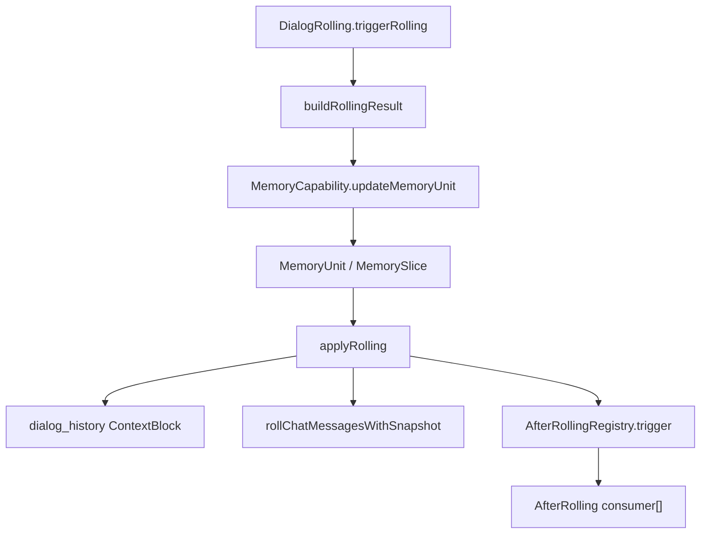

# AfterRolling

`AfterRolling` 是 `DialogRolling` 完成一次上下文滚动后的扩展点。它不生成原始记忆，而是消费已经生成的 `RollingResult`
，适用于维护组织层索引、补充组织信息，或执行与新记忆相关的异步副作用。

rolling 的主流程先完成原始记忆写入和当前上下文窗口裁剪，然后再触发 `AfterRollingRegistry`。因此，`AfterRolling` consumer
面对的是已经稳定生成的记忆结果，而不是待写入的临时数据。

## RollingResult

`RollingResult` 是 rolling 阶段传递给后处理 consumer 的数据包。

| 字段                  | 说明                    |
|---------------------|-----------------------|
| `memoryUnit`        | 本次 rolling 写入或更新的记忆单元 |
| `memorySlice`       | 本次 rolling 新生成的记忆切片   |
| `incrementMessages` | 本次进入记忆的增量消息           |
| `summary`           | 本次切片摘要                |
| `rollingSize`       | rolling 发生时的对话窗口大小    |
| `retainDivisor`     | rolling 后保留近期上下文的比例参数 |

这些字段让 consumer 可以同时看到三类信息：已经落盘的记忆对象、原始增量消息，以及本次 rolling 对上下文窗口的处理参数。

## 当前 consumer

当前 memory 侧的主要 consumer 是 `MemoryRecallProfileExtractor`。它消费 `RollingResult`，读取当前主题树、切片摘要和原始消息片段，提取：

- `topicPath`
- `relatedTopicPaths`
- `ActivationProfile`

随后它调用 `MemoryRuntime.recordMemory(...)`，把新切片写入主题索引和日期索引。也就是说，原始记忆的生成发生在
`DialogRolling` 中，索引和召回组织信息的补充发生在 `AfterRolling` consumer 中。
