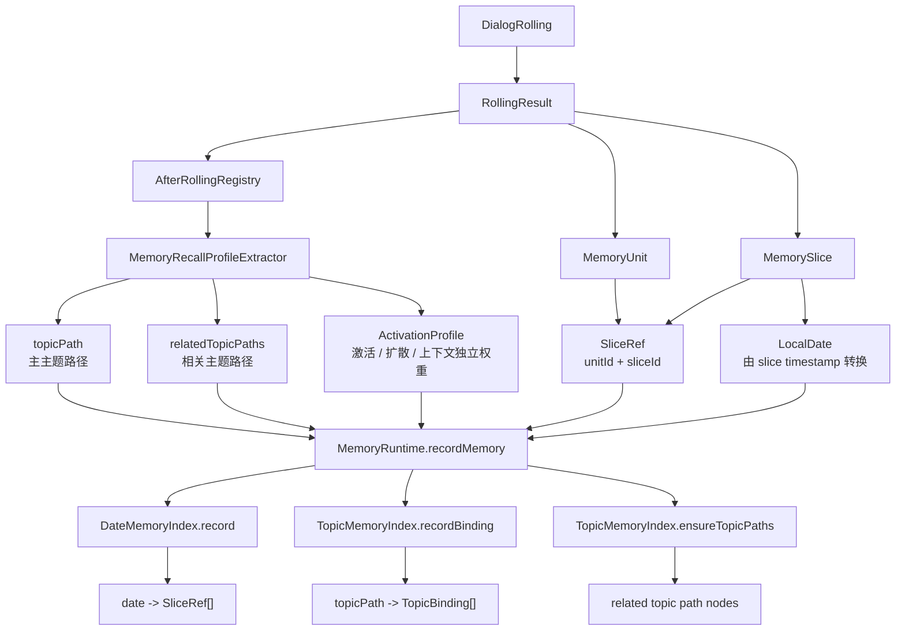
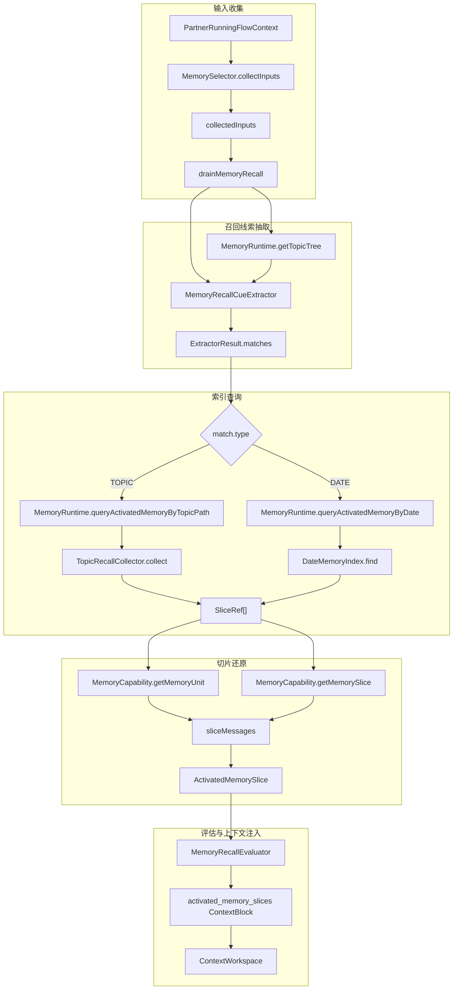

# 记忆检索

本文说明 Partner 记忆系统的组织层。存储层只保存稳定的 `MemoryUnit` 与 `MemorySlice`，检索层在这些数据之上建立可替换的召回结构。

当前默认实现是 `MemoryRuntime`：它维护主题路径索引和日期索引，并把索引结果重新解析为可注入上下文的 `ActivatedMemorySlice`。

| 索引                        | 作用                                       |
|---------------------------|------------------------------------------|
| `TopicMemoryIndex`        | 按主题路径组织 `MemorySlice`，支持主主题、父主题和相关主题扩散召回 |
| `DateMemoryIndex`         | 按日期记录 `MemorySlice` 引用，支持按日期直接召回         |
| `MemoryRuntimeStateCodec` | 负责主题索引和日期索引的持久化与恢复                       |

## 索引建立

`MemoryRuntime` 不直接生成原始记忆。原始记忆由 `DialogRolling` 写入 `MemoryUnit` 后，`AfterRolling` consumer 会消费
`RollingResult`，为新产生的 `MemorySlice` 提取主题路径、相关主题和激活参数，再调用 `MemoryRuntime.recordMemory(...)` 建立索引。



`TopicMemoryIndex` 的绑定对象不是完整记忆内容，而是 `SliceRef`。它只记录 `unitId`、`sliceId`、时间戳、相关主题路径和
`ActivationProfile`。真正需要展示原始消息时，`MemoryRuntime` 会再回到 `MemoryCapability` 读取对应 `MemoryUnit` 和
`MemorySlice`。

主题路径使用 `->` 表示层级，例如：

```text
project->partner->memory
```

`TopicMemoryIndex` 会按路径建立树节点；绑定到某个节点的 slice 表示该记忆切片属于这个主题。相关主题路径不会直接复制
slice，而是作为扩散召回的候选入口参与后续评分。

## 使用检索: 主题路径和日期索引

运行时召回由 `MemorySelector` 触发。它会收集输入，使用当前主题树和输入内容提取召回线索，再按线索类型分别查询主题索引或日期索引。



按主题召回时，`TopicRecallCollector` 会从三个来源收集候选：

| 来源        | 含义                    |
|-----------|-----------------------|
| `PRIMARY` | 当前主题节点直接绑定的 slice     |
| `PARENT`  | 父主题节点的近期候选，用于保留上层语境   |
| `RELATED` | 由当前主题绑定声明的相关主题，用于扩散召回 |

候选会经过 `TopicRecallScorer` 打分。分数综合来源类型、时间新近性、激活权重、上下文独立权重和扩散权重。最终结果会限制数量，并转换成
`ActivatedMemorySlice`。

`ActivatedMemorySlice` 包含 slice 摘要、日期、时间戳以及对应原始消息片段。`MemorySelector` 会基于这些结果构造
`activated_memory_slices` 上下文块，使后续 communication、cognition 或 action 模块能够读取被激活的记忆。
