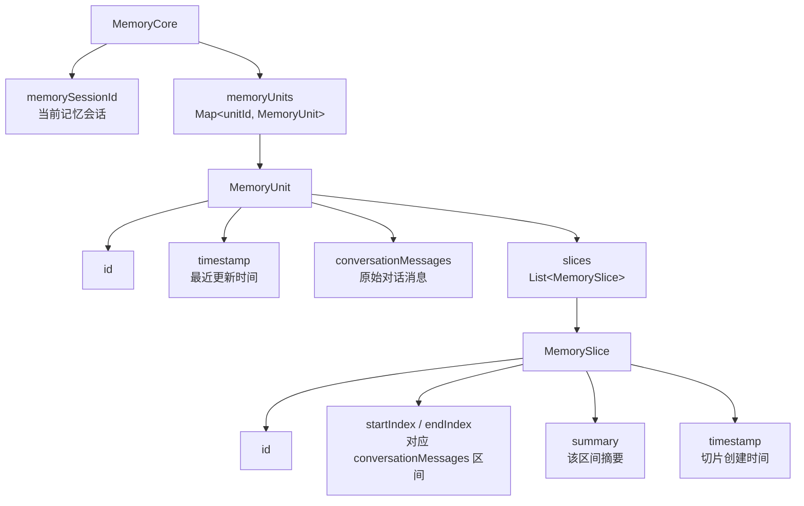
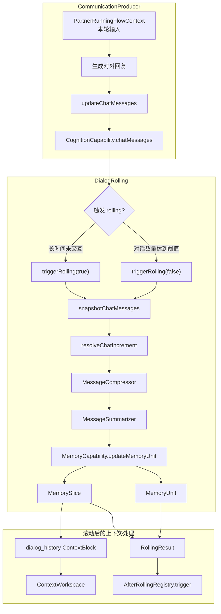

# 记忆存储

本文说明 Partner 记忆系统的稳定存储模型和原始记忆生成方式。

## MemoryUnit 与 MemorySlice

### 数据模型

存储层由 `MemoryCore`、`MemoryUnit` 和 `MemorySlice` 三层组成。

`MemoryCore` 维护记忆单元集合和当前记忆会话 id；`MemoryUnit` 是可持久化的记忆单元，保存一段对话消息及其摘要切片；
`MemorySlice` 是对 `MemoryUnit` 中一段消息区间的摘要。

`MemoryUnit` 的核心作用是把原始消息和摘要切片绑定在一起。`conversationMessages` 保存完整消息序列，`MemorySlice`
只记录它覆盖的消息区间和摘要内容。这样，召回层可以先使用摘要切片进行轻量检索，再在需要时回到对应 `MemoryUnit` 读取原始消息。

`MemoryCore` 自身只保存 `memorySessionId` 和 `memory_unit_uuid_set`，每个 `MemoryUnit` 独立持久化到自己的 state
path。也就是说，`MemoryCore` 负责管理有哪些记忆单元，而具体消息和切片内容保存在 `MemoryUnit` 中。

| 对象            | 作用                                 |
|---------------|------------------------------------|
| `MemoryCore`  | 维护当前记忆会话 id、记忆单元集合，并提供读写入口         |
| `MemoryUnit`  | 保存一组原始对话消息及其摘要切片，是稳定落盘单元           |
| `MemorySlice` | 描述 `MemoryUnit` 中一段消息区间的摘要，可被索引和召回 |

`MemorySlice` 会按创建时间参与排序；`MemoryCore` 在更新记忆时会对 slice 的 id、时间戳和消息区间做规范化，避免索引越界或缺失基础字段。

### 生成方式

`MemoryUnit` 与 `MemorySlice` 的原始材料来自对话轨迹。`CommunicationProducer` 在完成对外回复后，将本轮用户输入和 assistant
输出写回 `CognitionCapability` 维护的 chat messages；`DialogRolling` 在对话窗口过长或长时间未交互时，基于这些 chat
messages 生成记忆切片。

生成流程可以分成两段：

1. **对话轨迹写入**：`CommunicationProducer` 负责把本轮交流结果追加到 `chatMessages`。这里保存的是后续 rolling
   能够消费的原始对话轨迹。
2. **对话滚动入库**：`DialogRolling` 从当前对话快照中计算尚未进入当前 `MemoryUnit` 的增量消息，压缩并总结后调用
   `MemoryCapability.updateMemoryUnit(chatMessages, summary)`。该调用会把消息增量追加到 `MemoryUnit.conversationMessages`
   ，并创建一个覆盖这段消息区间的 `MemorySlice`。

`DialogRolling` 有两类触发方式：

| 触发方式     | 含义                                             |
|----------|------------------------------------------------|
| 对话数量达到阈值 | 当前上下文对话过长时触发 rolling，只保留部分近期上下文                |
| 长时间未交互   | 定时检查发现距离上次交互超过阈值时触发 rolling，并刷新 memory session |

rolling 完成后，系统会把新切片摘要注册为 `dialog_history` 上下文块，并裁剪当前 chat messages。随后 `AfterRollingRegistry`
会异步触发已注册的 `AfterRolling` consumer。这里的 consumer 只消费 `RollingResult`
，用于在原始记忆生成后执行额外维护逻辑；具体索引构建与召回组织在 [记忆检索](memory-retrieval.md)
中说明，扩展点机制见 [AfterRolling](after-rolling.md)。
