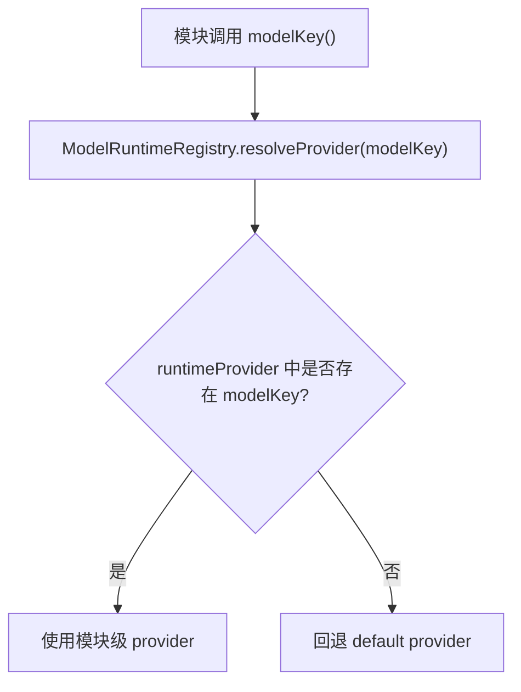
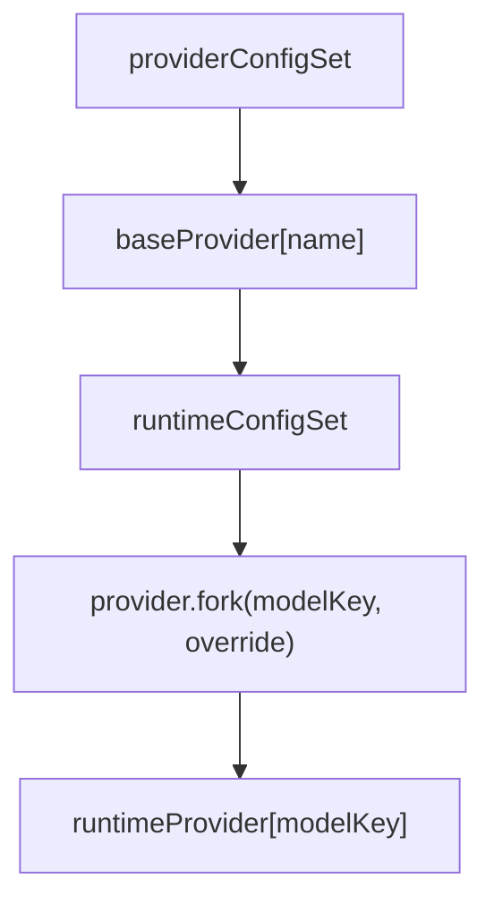
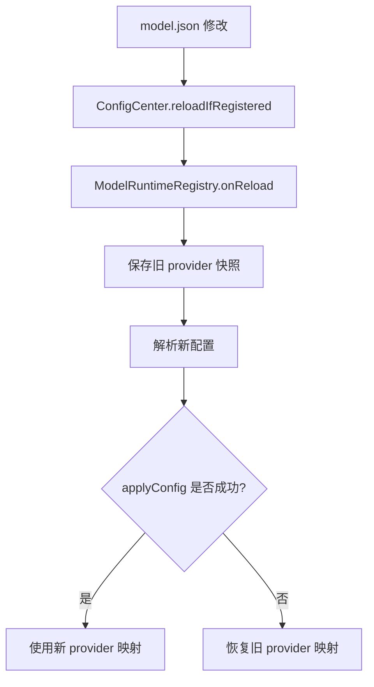

# 模型提供商

Partner 通过 `ModelRuntimeRegistry` 管理模型提供商。模块不直接持有具体供应商客户端，而是通过 `modelKey()` 从注册中心解析出对应的 `ModelProvider`，再执行 `chat`、`streamChat` 或 `formattedChat`。

当前内置 provider 类型为 `OPENAI_COMPATIBLE`。`ModelRuntimeRegistry` 提供基础 provider、模块级 provider、默认 fallback、环境变量默认配置和热重载回滚等机制。

## 核心角色

| 角色 | 职责 |
| --- | --- |
| `ModelRuntimeRegistry` | 管理基础 provider 与模块级 provider，负责 provider 解析、初始化和热重载。 |
| `ModelProvider` | 模型调用抽象，提供 `chat`、`streamChat`、`formattedChat` 等能力。 |
| `ProviderConfig` | 基础 provider 的配置类型。当前支持 `OPENAI_COMPATIBLE`。 |
| `RuntimeProviderConfig` | 模块级 provider 配置，用于把某个 `modelKey` 绑定到基础 provider，并应用 override。 |
| `ProviderOverride` | 模块级覆写项，例如 model、temperature、topP、maxTokens、extras。 |
| `ActivateModel` | 模块侧接口。实现该接口的模块通过 `modelKey()` 选择模型运行时。 |

## 配置入口

模型配置文件为：

```text
${PARTNER_HOME}/config/model.json
```

如果未设置 `PARTNER_HOME`，则默认位于：

```text
~/.partner/config/model.json
```

`model.json` 的完整字段说明见 [配置项说明 - ModelRuntime](../config/config-reference.md#modelruntime)。

一个最小配置通常包含名为 `default` 的基础 provider：

```json
{
  "providerConfigSet": [
    {
      "name": "default",
      "type": "OPENAI_COMPATIBLE",
      "defaultModel": "gpt-4.1-mini",
      "baseUrl": "https://api.example.com/v1",
      "apiKey": "example-api-key"
    }
  ],
  "runtimeConfigSet": []
}
```

`providerConfigSet` 声明基础 provider；`runtimeConfigSet` 声明模块级 provider。后者可以为空，此时所有没有单独配置的模块都会使用 `default` provider。

## Provider 解析流程

模块执行模型调用时，会通过自己的 `modelKey()` 向 `ModelRuntimeRegistry` 请求 provider。注册中心优先查找模块级 provider；如果没有命中，则回退到基础 provider 中名为 `default` 的 provider。



这个 fallback 规则意味着配置不需要覆盖每个模块。只有需要特殊模型、特殊参数或特殊供应商的模块才需要写入 `runtimeConfigSet`。

## 基础 Provider 与模块级 Provider

`providerConfigSet` 中的 provider 是基础 provider。基础 provider 通常描述一个 API endpoint，包括 provider 名称、类型、默认模型、base URL 和 API key。

`runtimeConfigSet` 中的 provider 是模块级 provider。它从某个基础 provider fork 出来，并应用模块级 override。



示例：让 `communication_producer` 使用同一个 `default` endpoint，但覆写模型与采样参数。

```json
{
  "modelKey": "communication_producer",
  "providerName": "default",
  "override": {
    "model": "gpt-4.1",
    "temperature": 0.7,
    "topP": 1.0,
    "maxTokens": 2048,
    "extras": {}
  }
}
```

当前 `ProviderOverride.model` 是必填字段。因此，即使只覆写 temperature 或 maxTokens，也需要同时写出 model。

## 环境变量默认配置

`ModelRuntimeRegistry` 在缺少 `model.json` 时支持从环境变量生成默认配置。需要同时提供以下三个变量：

```text
PARTNER_DEFAULT_BASE_URL
PARTNER_DEFAULT_API_KEY
PARTNER_DEFAULT_MODEL
```

当三个变量都存在时，注册中心会生成等价于以下内容的默认配置：

```json
{
  "providerConfigSet": [
    {
      "name": "default",
      "type": "OPENAI_COMPATIBLE",
      "defaultModel": "${PARTNER_DEFAULT_MODEL}",
      "baseUrl": "${PARTNER_DEFAULT_BASE_URL}",
      "apiKey": "${PARTNER_DEFAULT_API_KEY}"
    }
  ],
  "runtimeConfigSet": []
}
```

这个默认配置只创建 `default` provider，不创建任何模块级 override。若 `model.json` 存在，则优先使用文件配置。

## OpenAI-compatible Provider

当前内置 provider 类型为：

```text
OPENAI_COMPATIBLE
```

它用于接入兼容 OpenAI API 风格的模型服务。配置字段包括：

| 字段 | 含义 |
| --- | --- |
| `name` | provider 名称。必须至少存在一个名为 `default` 的 provider。 |
| `type` | provider 类型，当前为 `OPENAI_COMPATIBLE`。 |
| `defaultModel` | 该 provider 的默认模型。 |
| `baseUrl` | OpenAI-compatible API base URL。 |
| `apiKey` | API key。 |

只要远端接口保持 OpenAI-compatible 风格，就可以通过该 provider 接入。

## 热重载语义

模型配置支持热重载。`model.json` 修改后，`ConfigCenter` 会触发 `ModelRuntimeRegistry.onReload()`。



重载成功时，`baseProvider` 和 `runtimeProvider` 会被新配置替换。重载失败时，注册中心会恢复旧快照，避免一次错误配置导致运行中的模型调用全部失效。

启动期与运行期的失败语义不同：

- 启动期配置不可用时，会抛出启动异常并阻止 Agent 正常启动。
- 运行期热重载失败时，会记录错误并回滚到旧 provider 映射。

## 使用方式

- 可通过 `PARTNER_DEFAULT_BASE_URL`、`PARTNER_DEFAULT_API_KEY`、`PARTNER_DEFAULT_MODEL` 提供默认 provider。
- 可通过 `model.json` 显式声明基础 provider 和模块级 provider。
- `model.json` 中必须存在名为 `default` 的基础 provider。
- 没有出现在 `runtimeConfigSet` 中的模块会使用 `default` provider。
- 修改 `model.json` 后，如果热重载失败，运行时会保留旧 provider 映射。
